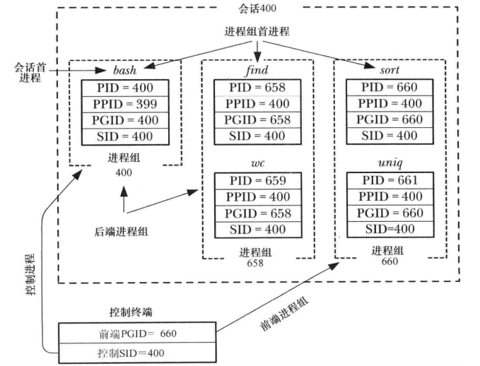

进程组，会话和控制终端之间的关系如下  
  
一个控制终端对应一个会话，会话包括多个进程组，进程组包括前端进程组和后端进程组

### 进程组
- 由上图可知，在同个进程组中的各个进程PGID一样，每个进程组首个进程称为进程组首进程，首进程的PID（进程ID）会成为PGID（进程组ID）；
- 前台进程组才可以从控制终端读取输入;
- 子进程会继承父进程的PGID（进程组ID）

#### getpgrp获取进程组ID
```c
#include <unistd.h>
pid_t getpgrp(void);
```

#### setpgid修改进程组ID
```c
// returns 0 on success, or -1 on error
#include <unistd.h>
int setpgid(pid_t pid, pid_t pgid)
```

### 会话
- 由上图可知，同个会话的所有进程的SID（会话ID）一样；首个创建该会话的进程成为会话首进程，会话首进程的PID会成为SID，如图bash为会话的首进程
- 子进程会继承父进程的SID（会话ID）

#### getsid获取会话ID
```c
// returns sid on success, or -1 on error
#include <unsitd.h>
pid_t getsid(pid_t pid)
```
当pid为0时，获取的是当前调用进程的会话ID

#### setsid设置会话ID
```c
// returns sid on success, or -1 on error
pid_t setsid(void)
```
- 如果调用进程不是会话首进程，那么会新建一个会话，否则调用会报出EPERM错误
- 会话被创建出来是没有控制终端（需要会话首进程打开一个终端才会建立控制终端），所有之前到控制终端的连接都会被断开

### 控制终端
- 会话首进程首次打开一个终端设备时会建立控制终端，当控制终端建立后，会话首进程会成为该终端的控制进程
- 子进程会继承父进程的控制终端
- 当断开和终端连接时，内核会向控制进程发送一个SIGHUP信号，这也是判断一个进程是否为控制进程的方法

### 参考
- Linux系统编程手册（下册）