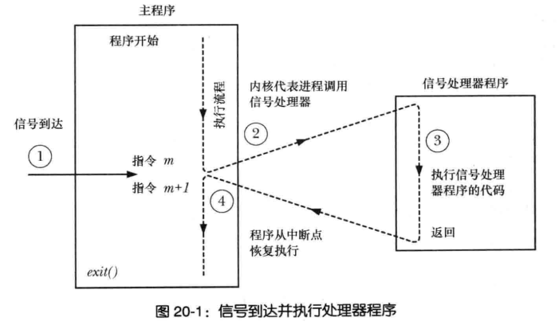
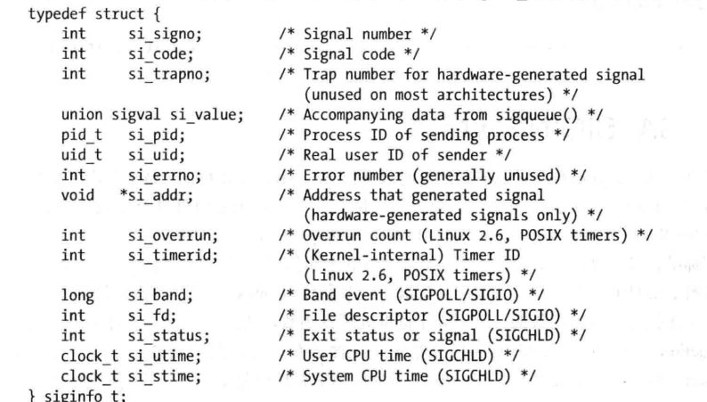
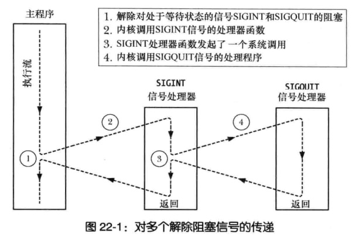

信号处理器会中断主程序的执行,直到信号处理器函数返回时,主程序从中断处继续执行
  
图片来源于Linux/Unix系统编程手册

### 同类信号阻塞
&emsp;&emsp;在执行某信号的处理器函数会阻塞同类信号(即处理器函数在执行过程,如果再次产生同类型信号,会将信号标记为等待状态,当处理器函数返回时再进行传递;若有有多个,则只会传递一次)

### 安全性问题
&emsp;&emsp;信号处理器会中断主程序运行,然后变成两条独立的线程(信号处理器和主程序),两条线程对全局变量的修改会相互影响对方,这就是所谓的不安全;(问题是既然中断了主程序执行,那么两个线程应该是不会同时调用某个函数或修改某个全局变量啊???原来是执行到一半的时候被中断了)
如何规避?
- 确保信号处理器函数使用可重入函数和异步信号安全函数
- 在主程序执行不安全函数时,阻塞信号的传递(借助于sigprocmask函数)

#### 重置errno问题
在入口处保存errno,在返回时恢复errno旧值
```c
void handler(int sig) {
    int oldErrno = errno;
    // do something
    errno = oldErrno;
}
```

### 全局变量声明
```c
volatile sig_atomic_t flag 
```
- 主程序和信号处理器函数共享全局变量,声明变量的时候使用volatile关键字
- sig_atomic_t整数数据类型,作用是保证读写操作的原子性

### 终止信号处理器其他方法
- 使用_exit()退出进程,不要使用exit(),exit()不是安全函数,它在调用_exit()函数之前会刷新stdio的缓冲区

### 备选栈处理信号
&emsp;&emsp;一般是内存不够了,才会需要备选栈的情况,先忽略它,有需要在回头总结下 todo review

### 非本地跳转技术
&emsp;&emsp;非本地跳转即从信号处理器跳转到主程序?实在看不懂...
```c
#include <setjmp.h>
sigsetjump(sigjmp_buf env, int savesigs)
siglongjump(sigjmp_buf env, int val)
// return 0 on initial call, nonzero on return via siglongjump()
```
- savesigs不为0,会将当前信号掩码添加到env中,之后可以通过siglongjump恢复
- 需要宏定义USE_SIGSETJMP

### SA_SIGINFO
信号处理器携带了额外信息,同时信号处理器应该声明如下:
```c
void handler(int sig, siginfo_t *siginfo, void *context);
```
相对的,sigaction的结构多一个sa_sigaction字段,如下:
```c
struct sigaction {
    union {
        void (*sa_hander)(int);
        void (*sa_sigaction)(int,siginfo_t *,void *);
    },
    sigset_t sa_mask;           // 信号掩码
    int flags;                  // 位掩码,标识信号处理器的行为
    void (*sa_restorer)(void)    
}
```
要获取signal.h对siginfo_t的声明,需要将特性测试宏_POSIX_C_SOURCE的值定义为大于或等于199309,siginfo结构如下:
  
图片来源于Linux/Uninx系统编程手册
- si_value包含调用sigqueue发送信号伴随的数据
- si_pid发送进程id
- si_fd包含于io相关的文件描述符号
- si_code信号来源;例如通过sigqueue发送的实时信号,该字段为SI_QUEUE

### 系统调用中断和重启
&emsp;&emsp;如果有一个阻塞的系统调用,当信号来传递过来时,主程序被中断,当信号处理器完成返回时,系统调用失败,并将errno设置为EINTR;如果要继续运行主程序,可以将sigaction.flags设置SA_RESTART(所谓的重启是主程序从中断处继续执行还是整个主程序重启?)

### 信号同步产生和异步产生
- 同步信号,执行进程知道信号产生的时机,例如执行进程调用raise()向自己发送一个信号
- 异步信号,执行进程不知道信号产生的时机,例如信号是由内核或其他进程发出的

### 信号传递时机和顺序
&emsp;&emsp;当进程解除对一组等待标准信号的阻塞的时候,与各个信号产生时机先后无关,等待信号会根据信号编号从小到大优先传递;执行流程如下:
  
图片来源于Linux/Unix系统编程手册

### 实时信号
实时信号和标准信号的区别:
- 标准信号编号为1~31,而实时信号为32~63
- 同类型信号被阻塞时产生多次,当解除阻塞时,标准信号只会传递一次,而实时信号因为会排队等待,可以都被传递
- 实时信号可以通过设置SA_SIGINFO传递给信号处理器额外的信息
- 一组标准信号在解除阻塞时,传递顺序按编号升序传递;实时信号根据信号发送顺序传递
- SIGRTMAX表示实时信号最大值
- SIGRTMIN表示实时信号最小值
发送实时信号如下:
```c
// Returns 0 on success , or -1 on error
sigqueue(pid_t pid, int sig, const union sigval value)
// union sigval
union sigval {
    int sival_int;      // 保存整数
    void *sival_ptr;    // 一个指针(一般用不到)
}
```
排队信号数量有限制,当sigqueue发送数量超过这个限制,调用失败并会设置errno为EAGAIN,表示需要再次发送该信号
demo:
```c
#define _POSIX_C_SOURCE 199309
#include <signal.h>
#include "../tlpi_hdr.h"

int main(int argc, char const *argv[])
{
    union sigval sv;
    pid_t pid;
    int sig, num, value;

    if (argc < 4 || strcmp(argv[1], "--help") == 0)
    {
        usageErr("%s pid sig value [num]\n", argv[0]);
    }

    printf("%s: pid: %ld; uid: %ld\n", argv[0], (long)getpid(), (long)getuid());

    pid = getLong(argv[1], GN_GT_0, "pid");
    sig = getInt(argv[2], GN_GT_0, "sig");
    value = getInt(argv[3], 0, "value");
    num = argc > 4 ? getInt(argv[4], GN_GT_0, "num") : 1;

    for (int i = 0; i < num; ++i)
    {
        sv.sival_int = value + i;
        if (sigqueue(pid, sig, sv) == 1)
        {
            errExit("sigqueue failed \n");
        }
    }

    return 0;
}
```

### 使用掩码来等待信号sigsuspend
&emsp;&emsp;使用掩码阻塞信号，防止信号中止主程序某关键代码段的执行；如果中断处发送在解除信号和pasue挂起进程之间，会导致信号处理器返回的时候，主程序将再次被挂起直到下一次信号到来（正常的情况是挂起进程后接收到信号，触发信号处理器，处理后退出进程）；  
sigsuspend把解除信号阻塞和挂起进程封装成一个原子操作
```c
// returns -1 with errno set to EINTR
sigsuspend(sigset_t *mask)
```
- mask代替进程的信号掩码,例如要解除某个信号，就把这个信号去掉，不要放在mask中
- 当处理器返回，sigsuspend会将进程的信号掩码恢复到调用前的值
demo
```c
#define _GNU_SOURCE
#include <signal.h>
#include "../tlpi_hdr.h"

void handler(int sig)
{
   printf("sig %i %s\n", sig, strsignal(sig));
}

int main(int argc, char const *argv[])
{
    struct sigaction sa;
    sigset_t blockMask, prevMask;

    printf("%s: pid:%ld; uid:%ld\n", argv[0], (long)getpid(), (long)getuid());

    sigaddset(&blockMask, SIGINT);
    sigaddset(&blockMask, SIGQUIT);

    // 阻塞SIGINT和SIGQUIT，并且保留原来的信号掩码，用于恢复
    if(sigprocmask(SIG_BLOCK, &blockMask, &prevMask) == -1)
    {
        errExit("sigprocmask failed \n");
    }

    sigemptyset(&sa.sa_mask);
    sa.sa_flags = 0;
    sa.sa_handler = handler;

    // 阻塞SIGINT和SIGQUIT信号
    if (sigaction(SIGINT, &sa, NULL) == -1)
    {
        errExit("sigaction SIGINT failed \n");
    }
    if (sigaction(SIGQUIT, &sa, NULL) == -1)
    {
        errExit("sigaction SIGQUIT failed \n");
    }

    // do something (不能被SIGINT和SIGQUIT信号中断的代码段，以sleep代替)
    sleep(10);

    // 解除信号阻塞并挂起进程
    if (sigsuspend(&prevMask) == -1 && errno != EINTR)
    {
        errExit("sigsuspend failed");
    }

    // 恢复信号掩码
    if (sigprocmask(SIG_SETMASK, &prevMask, NULL) == -1)
    {
        errExit("sigprocmask failed \n");
    }
    return 0;
}
```

### 同步等待信号到达

### signalfd应用

### 问题
- 信号处理器如何中断处于阻塞状态的系统调用,如何重启系统调用

