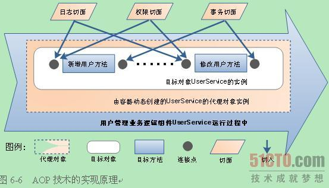

AOP是通过动态代理来实现的，是一种编程思想，对oop的补充，利用 AOP 可以对业务逻辑的各个部分进行隔离，从而使得业务逻辑各部分之间的耦合度降低，提高程序的可重用性，同时提高了开发的效率；用通俗的话来讲，就是在可以通过 `切面(Aspect)` 介入到任意类的任意方法的执行流程中去，从而改变或加强原方法的功能P。

业务逻辑组件在执行过程中，AOP容器会动态创建一个代理对象供使用者调用，该代理对象已经按Java EE程序猿的意图将切面成功切入到目标方法的连接点上。从而使切面的功能与业务逻辑的功能同一时候得以执行。从原理上讲，调用者直接调用的事实上是AOP容器动态生成的代理对象。再由代理对象调用目标对象完毕原始的业务逻辑处理。而代理对象则已经将切面与业务逻辑方法进行了合成。

## 解决了什么问题

- 解耦
- 代码复用
- 可维护

## 名词解释

**织入（Weaving）** 将切面应用到目标对象从而创建一个新的代理对象的过程。

**代理对象（Proxy）** 代理对象的功能等于目标对象的核心业务逻辑功能加上横切面的业务逻辑。

**目标对象（Target）** 需要被增强的类

**切入点（Pointcut）** 用于定义通知应该切入到哪些连接点上。

**连接点（Joinpoint）**：程序运行的某个特定的位置。比方类初始化前，初始化后。方法调用前。方法调用后等等

**通知（Advice）**：是切面的详细实现。以目标方法为參照点，依据放置的地方不同，可分为**前置通知（Before）**、**后置返回通知（AfterReturning）**、**后置****异常通知（AfterThrowing）**、**后置****终于通知（After）**与**围绕通知（Around）**5种。在实际应用中一般是切面类中的一个方法。详细属于哪类通知。相同是在配置中指定的。

 **切面（Aspect）**：由切点和增强组成，既包含了横切逻辑的定义。也包含了连接点的定义。

**增强**：织入到目标类连接点上的一段代码

## 参考

<https://www.cnblogs.com/cynchanpin/p/6931707.html>