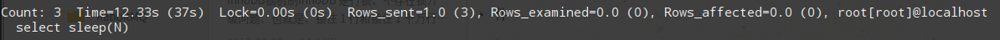

```sql
# 查看开启状态
show variables like 'slow_query_log'
# 查看日志文件
show variables like 'slow_query_log_file'
# 查看慢查询时间
show variables like 'long_query_time'
# 查看日志保存方式
show variables like 'log_output'
# 查看有多少条慢查询记录
show status like 'slow_queries'
```

## 修改配置文件
```bash
/opt/lampp/etc/my.cnf
[mysqld]
slow_query_log = ON
slow_query_log_file = /opt/lampp/logs/mysql-slow.conf
long_query_time = 2
```
配置好后需要重启mysql，试试下面的慢查询：
```sql
select sleep(3);
```
查看慢日志文件：
```bash
cat /opt/lampp/logs/mysql-slow.log
show status like 'slow_queries'
```

## mysqldumpslow日志分析:
- s 按某种方式排序
- r 返回记录数
- c 访问次数
- t 查询时间
- -t n 前面n条记录
- -g 正则匹配
```sql
# 返回结果最多的记录
mysqldumpslow -s r -t 10 /database/mysql/mysql06_slow.log

# 耗时最多的10条记录
mysqldumpslow -s t -t 10 /opt/lampp/logs/mysql-slow.log

# 访问次数最多的10记录
mysqldumpslow -s c -t 10 /opt/lampp/logs/mysql-slow.log
```
