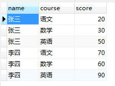
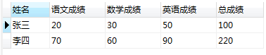
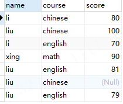
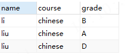

## 统计学生各科成绩

### 有如下score表：

```sql
CREATE TABLE `score` (
  `name` varchar(255) COLLATE utf8mb4_unicode_ci DEFAULT NULL,
  `course` varchar(255) COLLATE utf8mb4_unicode_ci DEFAULT NULL,
  `score` float DEFAULT NULL
) ENGINE=InnoDB DEFAULT CHARSET=utf8mb4 COLLATE=utf8mb4_unicode_ci;
```



### 现在要求学生的各科成绩和总分，效果图如下，写一段SQL得出如下结果：



### 查询SQL如下：

```sql
SELECT DISTINCT name '姓名', 
SUM(CASE
	WHEN course='语文' THEN score ELSE 0
	END) '语文成绩',
SUM(CASE course 
	WHEN '数学' THEN score ELSE 0
	END) '数学成绩',
SUM(CASE course 
	WHEN '英语' THEN score ELSE 0
	END) '英语成绩',
SUM(score) '总成绩'
 FROM score GROUP BY name
```


## 求评级

成绩为90-100的评分为A，成绩为75-89的评分为B，成绩为60-74的评分为C，其余的评分都为D 求出所有学生课程为chinese的评分



```sql
SELECT name,course,CASE 
WHEN score > 90 AND score <= 100  THEN 'A'
WHEN score > 75 AND score <= 89  THEN 'B'
WHEN score > 60 AND score <= 74 THEN 'C'
ELSE 'D' END  as grade
FROM
scores
where course = 'chinese'
```

执行结果如下： 