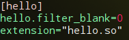

一般我们自定义的扩展都是以动态编译方式生成动态链接库.so文件，通过在php.ini读取扩展信息,php会将动态链接库加载到内存；php的扩展可以分为两类，一种是php扩展，需要实现zend_module_entry结构体，在php.ini中通过extension=xx.so加载扩展;一种是zend扩展，需要实现zend_extension,在php.ini通过zend_extension=xx.so加载扩展
以下主要记录php扩展：zend_module_entry定义了扩展的全部信息：扩展名、扩展版本、扩展提供的函数列表以及PHP四个执行阶段的hook函数等

### 第一步：生成骨架
位于源代码的ext目录下，执行
```c
./ext_skel --extname=hello --proto=hello.def
```
--proto用来指定函数原型，例如
```c
vi hello.def
int wcl(string filename) // 添加wcl函数原型，wcl用于统计文件行数
```
函数原型对应会生成如下代码：
```c
PHP_FUNCTION(wcl)
{
    char *filename = NULL;
    int argc = ZEND_NUM_ARGS();
    size_t filename_len;

    if (zend_parse_parameters(argc, "s", &filename, &filename_len) == FAILURE)
        return;

    php_error(E_WARNING, "wcl: not yet implemented");
}
```
PHP_FUNCTION(wcl)即我们要实现功能代码，如果不指定函数原型，需要自己手动添加该函数

### 第二步：config.m4配置编译信息
config.m4主要用于配置编译参数(PHP_ARG_ENABLE)和设置扩展的源文件(PHP_NEW_EXTENSION)
```c
PHP_ARG_ENABLE(hello, whether to enable hello support,
dnl Make sure that the comment is aligned:
[  --enable-hello           Enable hello support])
```
PHP_ARG_ENABLE对应编译时的--enable，表示是否启用扩展，这里将dnl注释去掉

```c
PHP_NEW_EXTENSION(hello, hello.c, $ext_shared,, -DZEND_ENABLE_STATIC_TSRMLS_CACHE=1)
```
- 第一个参数表示扩展名称
- 第二个参数表示扩展源文件列表，如果有多个源文件，需要以空格隔开；换行时加上反斜杠“\”

### 第三步：实现功能
在ext/hello/hello.c文件中，PHP_FUNCTION实现相应的功能
```c
/* {{{ proto int wcl(string filename)
    */
PHP_FUNCTION(wcl)
{
    char *filename = NULL;
    int argc = ZEND_NUM_ARGS();
    size_t filename_len;
    char ch;
    FILE *fp;
    zend_long lcount = 0;

    if (zend_parse_parameters(argc, "s", &filename, &filename_len) == FAILURE)
        return;

    if ((fp = fopen(filename, "r")) == NULL)
    {
        RETURN_FALSE;
    }

    while ((ch = fgetc(fp)) != EOF)
    {
        if (ch == '\n')
        {
            lcount++;
        }
    }
    fclose(fp);

    RETURN_LONG(lcount);
    // php_error(E_WARNING, "wcl: not yet implemented");
}
/* }}} */
```

### 第四步：注册函数
代码为hello.c源文件：
```c
/* {{{ hello_functions[]
 *
 * Every user visible function must have an entry in hello_functions[].
 */
const zend_function_entry hello_functions[] =
{
    PHP_FE(confirm_hello_compiled,  NULL)   /* For testing, remove later. */
    PHP_FE(wcl, NULL)
    PHP_FE_END  /* Must be the last line in hello_functions[] */
};
/* }}} */
```
通过PHP_FE把函数注册到zend_function_entry;每个扩展会注册一个名confirm_xxx_compiled的函数用来输出当前扩展是否已经被编译到PHP，通过php -f hello.php，如果出现以下信息表示成功
```c
Functions available in the test extension:
confirm_hello_compiled
wcl

Congratulations! You have successfully modified ext/hello/config.m4. Module hello is now compiled into PHP.
```

### 第五步：编译
```c
cd /opt/php7/php-7.2.10/ext/hello                           // 去到hello扩展目录
/opt/php7/php/bin/phpize         
./configure --with-php-config=/opt/php7/php/bin/php-config  // 指定php-config文件
make
sudo make install
```

### 第六步：php.ini添加扩展
```c
/opt/php7/php/bin/php --ini     // 找到配置文件位置
vi /opt/php7/php/ext/php.ini
extension=hello.so              // 在文件末尾添加
```

### 配置项
以上一个基本的扩展已经完成，如果需要设置配置项，如在php.ini注册一个ini配置项来控制是否计算空行，过程如下：

#### php_hello.h声明扩展内的全局变量
添加代码如下：
```c
ZEND_BEGIN_MODULE_GLOBALS(hello)
  zend_long filter_blank;
ZEND_END_MODULE_GLOBALS(hello)
```
扩展内全局变量通过HELLO_G(v)读取，源码如下：
```c
#define HELLO_G(v) ZEND_MODULE_GLOBALS_ACCESSOR(hello, v)
```

#### hello.c添加配置项
```c
ZEND_DECLARE_MODULE_GLOBALS(hello)

PHP_INI_BEGIN()
STD_PHP_INI_ENTRY("hello.filter_blank",  "0", PHP_INI_ALL, OnUpdateLong, filter_blank, zend_hello_globals, hello_globals)
PHP_INI_END()
```
以上代码为当前扩展注册了一个配置项hello.filter_blank

#### 模块初始化自动注册当前扩展配置项
```c
/* {{{ PHP_MINIT_FUNCTION
 */
PHP_MINIT_FUNCTION(hello)
{
    /* If you have INI entries, uncomment these lines
    REGISTER_INI_ENTRIES();
    */
    REGISTER_INI_ENTRIES(); // 去掉注释后
    return SUCCESS;
}
/* }}} */

/* {{{ PHP_MSHUTDOWN_FUNCTION
 */
PHP_MSHUTDOWN_FUNCTION(hello)
{
    /* uncomment this line if you have INI entries
    UNREGISTER_INI_ENTRIES();
    */
    UNREGISTER_INI_ENTRIES(); // 去掉注释后
    return SUCCESS;
}
/* }}} */
```

#### php.ini添加配置

