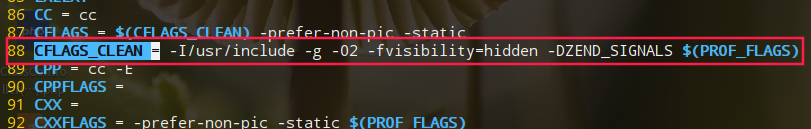

#### 安装
```bash
#!/bin/bash
wget http://ftp.gnu.org/gnu/gdb/gdb-8.2.tar.gz
./configure
make && make install
gdb -v
```

#### 使用
单独编译c文件的时候需要加入调试信息,用-g
```bash
gcc -g test.c -o test
```
如果是php需要修改下Makefile文件,如下:
  
把-O2修改为-O

#### 命令
```bash
gdb -q          # -q屏蔽显示版本之类的说明
file test       # 运行编译后test文件
```

```bash
gdb php         # 开始运行php
b main          # 在main函数打上断点
r test.php      # 运行test.php文件
```

- b <line_num|function_name> 打上断点(break 7 if n==6表示第七行条件n为6打上断点)
- l <start,end> list显示源代码
- n next下一行代码
- s step下一步代码
- c continue继续运行到下一个断点
- r run运行代码
- info b显示所有断点
- disable <num> 禁用断点
- delete <num> 删除断点
- p <var> print打印变量
- whatis <var> 显示变量类型
- q退出

#### 多进程调试

#### 多线程调试

[参考](https://www.cnblogs.com/life2refuel/p/5396538.html)