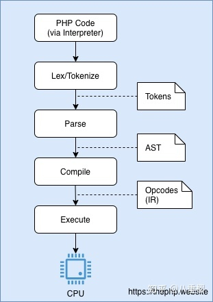

## 命名参数

仅仅指定必填参数，跳过可选参数，参数的顺序无关

```php
htmlspecialchars($string, ENT_COMPAT | ENT_HTML401, 'UTF-8', false);
//改为
htmlspecialchars($string, double_encode: false);
```

## 注解

```php
class PostsController
{
    #[Route("/api/posts/{id}", methods: ["GET"])]
    public function get($id) { /* ... */ }
}
```

## 构造器属性提升

```php
class Point {
  public float $x;
  public float $y;
  public float $z;
  public function __construct(
    float $x = 0.0,
    float $y = 0.0,
    float $z = 0.0
  ) {
    $this->x = $x;
    $this->y = $y;
    $this->z = $z;
  }
}
//改为
class Point {
  public function __construct(
    public float $x = 0.0,
    public float $y = 0.0,
    public float $z = 0.0,
  ) {}
}
```

## 联合类型 

```php
class Number {
  /** @var int|float */
  private $number;
  /**
   * @param float|int $number
   */
  public function __construct($number) {
    $this->number = $number;
  }
}
new Number('NaN'); // Ok
//改为
class Number {
  public function __construct(
    private int|float $number
  ) {}
}
new Number('NaN'); // TypeError
```

## Match 表达式

```php
switch (8.0) {
  case '8.0':
    $result = "Oh no!";
    break;
  case 8.0:
    $result = "This is what I expected";
    break;
}
echo $result;
//> Oh no!

//改为

echo match (8.0) {
  '8.0' => "Oh no!",
  8.0 => "This is what I expected",
};
//> This is what I expected
```

- Match 是一个表达式，它可以储存到变量中亦可以直接返回。
- Match 分支仅支持单行，它不需要一个 break; 语句。
- Match 使用严格比较。

## Nullsafe 运算符

```php
$country =  null;
if ($session !== null) {
  $user = $session->user;
  if ($user !== null) {
    $address = $user->getAddress();
  
    if ($address !== null) {
      $country = $address->country;
    }
  }
}
//改为
$country = $session?->user?->getAddress()?->country;
```

现在可以用新的 nullsafe 运算符链式调用，而不需要条件检查 null。 如果链条中的一个元素失败了，整个链条会中止并认定为 Null

## 字符串与数字的比较更符合逻辑

```php
0 == 'foobar' // true
//改为
0 == 'foobar' // false
```

`php7`会先将字符串转为数字再比较比较，而`php8`会当`foobar`不是数字字符串时，将数字0转为字符串再比较

## 即时编译

即时编译引擎`jit` （Just In Time）

当 JIT 按预期工作时，您的代码不会通过 Zend VM 执行，而是作为一组 CPU 级指令直接执行

每次执行 PHP 代码（命令行脚本或者 WEB 应用）时，都要经过 PHP 解释器。最常用的是 PHP-FPM 和 CLI 解释器。解释器的工作很简单：接收 PHP 代码，对其进行解释，然后返回结果。

### php解析代码过程

1. 读取 PHP 代码并将其解释为一组称为 Tokens 的关键字。这个过程让解释器知道各个程序都写了哪些代码。 这一步称为 Lexing 或 Tokenizing 。

2. 拿到 Tokens 集合以后，PHP 解释器将尝试解析他们。通过称之为 Parsing 的过程生成抽象语法树（AST）。

3. 将 AST 转换为 Opcodes 的过程称为 compilation 。

4. 有了 Opcodes ，有趣的部分就来了： executing 代码！ PHP 有一个称为 Zend VM 的引擎，该引擎能够接收一系列 Opcodes 并执行它们。执行所有 Opcodes 后， Zend VM 就会将该程序终止。 

    

### Opcache 扩展

扩展的作用是为 Opcodes 添加一个内存共享缓存层，它的工作是从 AST 中提取新生成的 Opcodes 并缓存它们，以便执行时可以跳过 Lexing/Tokenizing 和 Parsing 步骤

如果说 Opcache 扩展可以更快的获取 Opcodes 将其直接转到 Zend VM运行，则 JIT 让它们完全不使用 Zend VM 即可运行。

 JIT对`opcache`进行增强，将`opcaches`装换为机器码从而绕过`zend vm`，直接由cpu运行，不过 JIT 主要针对 CPU 密集型操作优化效果明显，而目前主流的 PHP Web 应用都是 IO 密集型操作，


## 参考

<https://www.php.net/releases/8.0/zh.php>