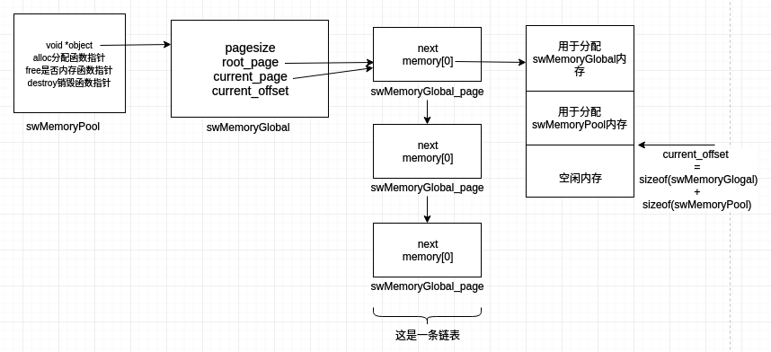

### 内存池的作用：
直接使用系统调用malloc会有如下弊端：
- 频繁分配内存时会产生大量内存碎片
- 频繁分配内存增加系统调用开销
- 容易造成内存泄漏  
> 内存池是预先申请一定数量的，大小相等的内存块作为预备使用；当需要时向内存池分出一部分内存，若内存块不够使用时再向系统申请新的内存块，下面就swoole的swMemoryGlobal内存池作为分析例子

### swoole swMemoryPool 数据结构设计
swMemoryGlobal是swoole内存池实现一种方式，学习内存池主要是要掌握其数据结构的设计，memoryGlobal实现如下：
```c
// src/memory/MemoryGlobal.c
typedef struct _swMemoryPool
{
	void *object;                                               // 指向swMemoryGlobal指针
	void* (*alloc)(struct _swMemoryPool *pool, uint32_t size);  // 分配内存函数指针
	void (*free)(struct _swMemoryPool *pool, void *ptr);        // 是否内存函数指针
	void (*destroy)(struct _swMemoryPool *pool);                // 销毁内存函数指针
} swMemoryPool;

typedef struct _swMemoryGlobal
{
    uint8_t shared;                      
    uint32_t pagesize;                    // 指定每个swMemoryGlobal_page需要申请内存大小
    swLock lock;                          // 互斥锁
    swMemoryGlobal_page *root_page;       // 指向第一个swMemoryGlobal_page指针，有头指针可以销毁内存池
    swMemoryGlobal_page *current_page;    // 指向当前swMemoryGlobal_page指针
    uint32_t current_offset;
} swMemoryGlobal;

typedef struct _swMemoryGlobal_page
{
    struct _swMemoryGlobal_page *next;    // 指向下一个节点
    char memory[0];                       // 这是一个柔性数组，用于记录申请内存后的内存地址
} swMemoryGlobal_page;
```
这三者之间的关系如下：  
  

### swMemoryPool
swMemoryPool可以看做是一个类，它提过了alloc,free,destory方法，以及object属性，object实际上是指向swMemoryGlobal的指针，而alloc,free,destory
则是对object操作，即通过alloc,free,destory操作swMemoryGlobal上的内容，例如：
```c
// src/core/base.c
//init global shared memory
SwooleG.memory_pool = swMemoryGlobal_new(SW_GLOBAL_MEMORY_PAGESIZE, 1);
SwooleGS = SwooleG.memory_pool->alloc(SwooleG.memory_pool, sizeof(SwooleGS_t));
```
以上代码是分配sizeof(SwooleGS_t)大小内存

### swMemoryGlobal
swMemoryGlobal维护着一个链表，每个节点即swMemoryGlobal_page，root_page指向第一个节点，current_page指向当前节点，pagesize指为一个节点申请
内存大小，current_offset则表示一个节点已被使用内存

### swMemoryGlobal_page
swoole根据swMemoryGlobal.pagesize申请指定大小的内存，如下：
```c
// src/memory/MemoryGlobal.c
swMemoryGlobal_page *page = swMemoryGlobal_new_page(&gm);
```
上面说过swMemoryGlobal_page是一个链表节点，这里需要说明的是第一个节点，第一个节点的current_offset为sizeof(swMemoryGlobal) + sizeof(swMemoryPool);
而并非为0；如下代码，当为第一个swMemoryGlobal_page申请内存后，立马就为swMemoryPool和swMemoryGlobal分配内存
```c
// src/memory/MemoryGlobal.c
gm.pagesize = pagesize;
// 系统申请一个pagesize大小内存
swMemoryGlobal_page *page = swMemoryGlobal_new_page(&gm);
if (page == NULL)
{
    return NULL;
}
if (swMutex_create(&gm.lock, shared) < 0)
{
    return NULL;
}
    
gm.root_page = page;

// page->memory为空闲内存
gm_ptr = (swMemoryGlobal *) page->memory;
gm.current_offset += sizeof(swMemoryGlobal);

// swMemoryPool指向空闲内存偏移地址，占用sizeof(swMemoryPool)内存
swMemoryPool *allocator = (swMemoryPool *) (page->memory + gm.current_offset);
gm.current_offset += sizeof(swMemoryPool);

allocator->object = gm_ptr;
allocator->alloc = swMemoryGlobal_alloc;
allocator->destroy = swMemoryGlobal_destroy;
allocator->free = swMemoryGlobal_free;

// 将gm写入到gm_ptr，即空闲内存前sizeof(gm)用于swMemoryGlobal
memcpy(gm_ptr, &gm, sizeof(gm));
```

### 分配内存
分配内存由swMemoryGlobal_alloc方法执行；该方法为swMemoryPool一个函数指针，如下
```c
allocator->alloc = swMemoryGlobal_alloc;        // 分配方法
```

```c
// src/core/base.c
//init global shared memory
SwooleG.memory_pool = swMemoryGlobal_new(SW_GLOBAL_MEMORY_PAGESIZE, 1);
SwooleGS = SwooleG.memory_pool->alloc(SwooleG.memory_pool, sizeof(SwooleGS_t));

// src/memory/MemoryGlobal.c
static void *swMemoryGlobal_alloc(swMemoryPool *pool, uint32_t size)
{
    swMemoryGlobal *gm = pool->object;
    gm->lock.lock(&gm->lock);
    if (size > gm->pagesize - sizeof(swMemoryGlobal_page)) // sizeof(swMemoryGlobal_page)为swMemoryGlobal_page类型的指针大小
    {
        swWarn("failed to alloc %d bytes, exceed the maximum size[%d].", size, gm->pagesize - (int) sizeof(swMemoryGlobal_page));
        gm->lock.unlock(&gm->lock);
        return NULL;
    }
    // 如果一个节点不够分配内存，则重新申请一个新节点，并设置当前节点current_page为新节点
    if (gm->current_offset + size > gm->pagesize - sizeof(swMemoryGlobal_page))
    {
        swMemoryGlobal_page *page = swMemoryGlobal_new_page(gm);
        if (page == NULL)
        {
            swWarn("swMemoryGlobal_alloc alloc memory error.");
            gm->lock.unlock(&gm->lock);
            return NULL;
        }
        gm->current_page = page;
    }
    void *mem = gm->current_page->memory + gm->current_offset;
    gm->current_offset += size;
    gm->lock.unlock(&gm->lock);
    
    // 结果返回空闲内存的偏移地址
    return mem;
}
```

### 柔性数组
柔性数组（0长度数组）作用： 为了满足需要变长度的结构体（结构体是可变长的）
- 数组名不占用空间，分配的内存是连续的
- 不会像定长数组一样浪费空间
- 不会像指针一样需要分别分配内存，分别释放内存

定长数组使用方便, 但是却浪费空间, 指针形式只多使用了一个指针的空间, 不会造成

[柔性数组参考](http://www.360doc.com/content/17/1119/10/9200790_705214752.shtml)