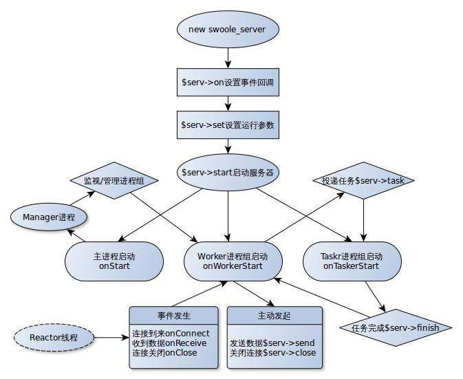

## server运行原理

### 进程 / 线程结构图

 

## [Server 的两种运行模式介绍](https://wiki.swoole.com/#/learn?id=server%e7%9a%84%e4%b8%a4%e7%a7%8d%e8%bf%90%e8%a1%8c%e6%a8%a1%e5%bc%8f%e4%bb%8b%e7%bb%8d)

在 `Swoole\Server` 构造函数的第三个参数，可以填 2 个常量值 -- [SWOOLE_BASE](https://wiki.swoole.com/#/learn?id=swoole_base) 或 [SWOOLE_PROCESS](https://wiki.swoole.com/#/learn?id=swoole_process)，下面将分别介绍这两个模式的区别以及优缺点

### [SWOOLE_PROCESS](https://wiki.swoole.com/#/learn?id=swoole_process)

SWOOLE_PROCESS 模式的 `Server` 所有客户端的 TCP 连接都是和[主进程](https://wiki.swoole.com/#/learn?id=reactor%e7%ba%bf%e7%a8%8b)建立的，内部实现比较复杂，用了大量的进程间通信、进程管理机制。适合业务逻辑非常复杂的场景。`Swoole` 提供了完善的进程管理、内存保护机制。 在业务逻辑非常复杂的情况下，也可以长期稳定运行。

`Swoole` 在 [Reactor](https://wiki.swoole.com/#/learn?id=reactor%e7%ba%bf%e7%a8%8b) 线程中提供了 `Buffer` 的功能，可以应对大量慢速连接和逐字节的恶意客户端。

#### [进程模式的优点：](https://wiki.swoole.com/#/learn?id=%e8%bf%9b%e7%a8%8b%e6%a8%a1%e5%bc%8f%e7%9a%84%e4%bc%98%e7%82%b9%ef%bc%9a)

- 连接与数据请求发送是分离的，不会因为某些连接数据量大某些连接数据量小导致 `Worker` 进程不均衡
- `Worker` 进程发送致命错误时，连接并不会被切断
- 可实现单连接并发，仅保持少量 `TCP` 连接，请求可以并发地在多个 `Worker` 进程中处理

#### [进程模式的缺点：](https://wiki.swoole.com/#/learn?id=%e8%bf%9b%e7%a8%8b%e6%a8%a1%e5%bc%8f%e7%9a%84%e7%bc%ba%e7%82%b9%ef%bc%9a)

- 存在 `2` 次 `IPC` 的开销，`master` 进程与 `worker` 进程需要使用 [unixSocket](https://wiki.swoole.com/#/learn?id=%e4%bb%80%e4%b9%88%e6%98%afipc) 进行通信

### [SWOOLE_BASE](https://wiki.swoole.com/#/learn?id=swoole_base)

SWOOLE_BASE 这种模式就是传统的异步非阻塞 `Server`。与 `Nginx` 和 `Node.js` 等程序是完全一致的。

[worker_num](https://wiki.swoole.com/#/server/setting?id=worker_num) 参数对于 `BASE` 模式仍然有效，会启动多个 `Worker` 进程。

当有 TCP 连接请求进来的时候，所有的 Worker 进程去争抢这一个连接，并最终会有一个 worker 进程成功直接和客户端建立 TCP 连接，之后这个连接的所有数据收发直接和这个 worker 通讯，不经过主进程的 Reactor 线程转发。

- `BASE` 模式下没有 `Master` 进程的角色，只有 [Manager](https://wiki.swoole.com/#/learn?id=manager%e8%bf%9b%e7%a8%8b) 进程的角色。
- 每个 `Worker` 进程同时承担了 [SWOOLE_PROCESS](https://wiki.swoole.com/#/learn?id=swoole_process) 模式下 [Reactor](https://wiki.swoole.com/#/learn?id=reactor%e7%ba%bf%e7%a8%8b) 线程和 `Worker` 进程两部分职责。
- `BASE` 模式下 `Manager` 进程是可选的，当设置了 `worker_num=1`，并且没有使用 `Task` 和 `MaxRequest` 特性时，底层将直接创建一个单独的 `Worker` 进程，不创建 `Manager` 进程

#### [BASE 模式的优点：](https://wiki.swoole.com/#/learn?id=base%e6%a8%a1%e5%bc%8f%e7%9a%84%e4%bc%98%e7%82%b9%ef%bc%9a)

- `BASE` 模式没有 `IPC` 开销，性能更好
- `BASE` 模式代码更简单，不容易出错

#### [BASE 模式的缺点：](https://wiki.swoole.com/#/learn?id=base%e6%a8%a1%e5%bc%8f%e7%9a%84%e7%bc%ba%e7%82%b9%ef%bc%9a)

- `TCP` 连接是在 `Worker` 进程中维持的，所以当某个 `Worker` 进程挂掉时，此 `Worker` 内的所有连接都将被关闭
- 少量 `TCP` 长连接无法利用到所有 `Worker` 进程
- `TCP` 连接与 `Worker` 是绑定的，长连接应用中某些连接的数据量大，这些连接所在的 `Worker` 进程负载会非常高。但某些连接数据量小，所以在 `Worker` 进程的负载会非常低，不同的 `Worker` 进程无法实现均衡。
- 如果回调函数中有阻塞操作会导致 `Server` 退化为同步模式，此时容易导致 TCP 的 [backlog](https://wiki.swoole.com/#/server/setting?id=backlog) 队列塞满问题。