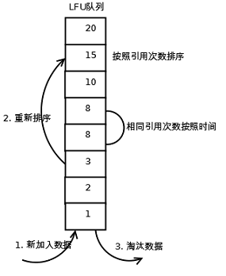

## Redis配置内存为多少合适？

**默认**：如果**不设置最大内存**大小或者**设置最大内存大小为0**，在**64为操作系统下不限制内存大小**，在**32位操作**系统下**最多使用3GB**内存。

一般推荐Redis设置**内存为最大物理内存的75%都是安全**的 


## 如何修改内存

**redis.conf中**

```php
maxmemory  104857600
config set maxmemory 104857600
```


## Redis的内存淘汰策略

### 过期策略

- 定期删除
- 惰性删除

### 内存淘汰机制 

- lru - 最近最少使用的 key，也就是首先淘汰最长时间未被使用的缓存，强调的是时间
- random - 随机删除
- lfu - 最近最不经常使用，,也就是淘汰一定时期内被访问次数最少的缓存，强调的是频率

### LRU算法原理

其原理是维护一个双向链表，key -> node，其中node保存链表前后节点关系及数据data。新插入的key时，放在头部，并检查是否超出总容量，如果超出则删除最后的key；访问key时，无论是查找还是更新，将该Key被调整到头部。


Redis并没有使用严格的LRU算法，因为维护一个那么大的双向链表需要的内存空间较大。redis通过随机采样法淘汰数据，每次随机出5（默认）个key，从里面淘汰掉最近最少使用的key。

显然LRU的缺陷是明显的，最新访问的数据被当做热数据显然是不合理的，热数据顾名思义就是被访问频次叫高的数据，显然是不同的概念

### LFU算法原理

假如你使用的是LRU算法，一个key很久没有被访问到，只刚刚是偶尔被访问了一次，那么它就被认为是热点数据，不会被淘汰，而有些key将来是很有可能被访问到的则被淘汰了。如果使用LFU算法则不会出现这种情况，因为使用一次并不会使一个key成为热点数据。LFU原理使用计数器来对key进行排序，每次key被访问的时候，计数器增大。计数器越大，可以约等于访问越频繁。具有相同引用计数的数据块则按照时间排序。



LFC算法存在两个问题：

- 在LRU算法中可以维护一个双向链表，然后简单的把被访问的节点移至链表开头，但在LFU中是不可行的，节点要严格按照计数器进行排序，新增节点或者更新节点位置时，时间复杂度可能达到O(N)。
- 只是简单的增加计数器的方法并不完美。访问模式是会频繁变化的，一段时间内频繁访问的key一段时间之后可能会很少被访问到，只增加计数器并不能体现这种趋势


## 参考

- <https://blog.csdn.net/raoxiaoya/article/details/103141022>