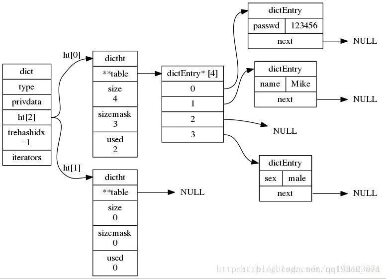

> 每次在Redis数据库中创建一个键值对时，至少会创建两个对象，一个是键对象，一个是值对象，而Redis中的每个对象都是由 `redisObject` 结构来表示
```c
typedef struct redisObject{
     //类型
     unsigned type:4;
     //编码
     unsigned encoding:4;
     //指向底层数据结构的指针
     void *ptr;
     //引用计数
     int refcount;
     //记录最后一次被程序访问的时间
     unsigned lru:22;
}robj
```
对象指向数据结构由`encoding`属性决定；如下：


每种类型的对象使用了多种编码


```bash
#查看对象类型 
type key
#查看对象编码
object encoding key
```

## string
> 一个redis中字符串value最多可以是`512M`
字符串对象的编码可以是`int`，`raw(大于44字节的长字符串)`或者`embstr(小于44字节的小字符串)`。
### raw和embstr的区别
`embstr`只分配一次内存，只读，`raw`需要分配两次内存（分别为redisObject和sds分配空间）

`embstr`编码的字符串对象的所有数据都在一块连续的内存


## 哈希hash

键值对`key-value`
查询的时间复杂度为`O(1)`
hash编码有两种`压缩列表`和`字典`
### 压缩列表
- 当哈希类型元素个数小于hash-max-ziplist-entries配置（默认512个）；
- 所有值都小于hash-max-ziplist-value配置（默认64个字节）；



从源码中可以看出，dict 结构内部包含两个 hashtable，通常情况下只有一个 hashtable 是有值的。

但是在 dict 扩容缩容时，需要分配新的 hashtable，然后进行渐进式搬迁，这时候两个 hashtable 存储的分别是旧的 hashtable 和新的 hashtable。待搬迁结束后，旧的 hashtable 被删除，新的 hashtable 取而代之。

 

## 列表list
有两个特点，`有序`，可重复性
在版本3.2之前使用的是两种数据结构，`linkedlist(双端链表)`和`ziplist(压缩列表)`；因为双向链表占用的内存比压缩列表要多， 所以当创建新的列表键时， 列表会优先考虑使用压缩列表， 并且在有需要的时候， 才从压缩列表实现转换到双向链表实现。

```bash
#redis.conf
list-max-ziplist-value 64 
list-max-ziplist-entries 512 
```
当压缩链表entry数据超过512、或单个value 长度超过64，底层就会转化成linkedlist编码；

在版本3.2之后，由于`listedlist`和`ziplist`有缺点，采用了`quicklist`，它是一个双向链表`linkedlist(双端链表)`，每一个节点是 `ziplist(压缩列表)`  


## 集合
有两个特点，`无序`，`不可重复`，应用场景是求集合的并集，集合是通过哈希表实现的，所以查找，添加，删除的复杂度都是O(1)
集合的编码类型是`REDIS_ENCODING_HT字典`和`REDIS_ENCODING_INTSET整数集合`
当满足下面条件时使用`整数集合编码`
- Set集合中必须是64位有符号的十进制整型；
- 元素个数不能超过set-max-intset-entries配置，默认512；


## 有序集合
https://www.jianshu.com/p/35bce2ea5743
有序的，元素不重复，每个元素会关联一个score用于排序，score是可以重复的
有序集合两种编码，分别为压缩列表和跳跃表（`REDIS_ENCODING_ZIPLIST`和`REDIS_ENCODING_SKIPLIST`）
### 压缩列表

当有序集合对象同时满足以下两个条件时，对象使用 ziplist 编码：
- 1、保存的元素数量小于128；
- 2、保存的所有元素长度都小于64字节。
### 跳跃表


## stream

其实是一个队列，每一个key对应一个队列


## 问题

### set和hash的关系是什么？
两者都是`REDIS_ENCODING_HT`字典类型时，`set`的value为null的特殊字典`dict`

### 如何借助Sorted set实现多维排序?
可以把涉及排序的多个维度的列按照一定方式组成score，例如按照时间time和下载量download排序，score=time+download


## 参考

- https://blog.csdn.net/chenssy/article/details/103856180

## 简单动态字符串（simple dynamic string,SDS）

```c
struct sdshdr{
//记录buf数据中已使用字节数据
//等于SDS所保存字符串的长度
 int len;

//记录buf数组中未使用字节的数量
int free;

//字节数组，用于保存字符串
char buf[];
}
```

redis没有直接使用C语言的字符串，而是使用了自己创建的简单动态字符串的数据结构，包含三个字段：`已使用长度`，`未使用长度`，`字节数组`

### 好处

- 获取字符串长度时间复杂度为`O(1)`,而c语言则需要`O(N)`
- 防止缓冲区溢出，C字符串不记录自身长度，如果在做字符串扩大的操作，如果事先没有为其设置足够的内存空间，则会引起内存溢出的情况，而`sds`则会根据`sds.len`判断是否有足够的空间，如果不够大，则先进行扩容，然后再写入内容
- 二进制安全，例如C语言字符串里不能包含空字符，否则最先被程序读入的空字符将被误认为是字符串结尾，这些限制使得C字符串只能保存文本数据，而不能保存像图片、音频、书品、压缩文件这样的二进制数据


## 链表

```c
typedef  struct listNode{
       //前置节点
       struct listNode *prev;
       //后置节点
       struct listNode *next;
       //节点的值
       void *value;  
}listNode
```

链表有`prev`,`next`前后指针，可以进行双向遍历；`head`,`tail`头尾两个指针可以实现头尾插入的复杂度为`O(1)`


## 字典

一种用于保存键值对的抽象数据结构，redis的字典使用哈希表作为底层实现，每个字典通常有两个哈希表，一个平时使用，另一个用于rehash时使用；随着数据量的不断增加，数据必然会发生`hash冲撞`，使用链地址法解决哈希冲突
还有一个`rehash`过程，渐进式rehash的好处是它采取分而治之的方式，将rehash键值所需的计算工作均摊到对字典的每个添加、删除、查找和更新操作上，从而避免了集中式rehash带来的庞大计算量

每个字典包含两个`hashtable`，一个用于正常的读写，一个用于哈希表`rehash`的临时载体

扩容的条件
负载因子 = 哈希表保存的key的数量 / 哈希表的大小


### 如何解决哈希冲突

- 开放地址法
- 链地址法


## 跳跃表


跳跃表是一种基于有序链表的扩展，表中的节点按照分值大小进行排序。为了加速搜索，每个的节点会通过抛硬币的方法选择是否往上一层建立索引，最终构建成一个分层链表结构，搜索的方式是从左到右，从高层到低层

### 特点

- 每个节点维护多个指向其他节点的指针
- 多层结构，每一层都是一个有序链表，最底层链表保存所有元素和分值
- 链表中两个节点包括两个指针，一个指向同一层的下一个链表节点，另一个指向下一层的同一个链表节点
  总体上，跳跃表插入操作的时间复杂度是O（logN），而这种数据结构所占空间是2N，既空间复杂度是 O（N）

### 跳跃表和二叉查找树的区别

跳跃表的优点是维持结构平衡的成本比较低，完全依靠随机，而二叉查找树在多次插入删除后，需要rebalance来重新调整结构平衡
https://www.jianshu.com/p/dc252b5efca6


## 整数集合

整数集合（intset）是Redis用于保存整数值的集合抽象数据类型，它可以保存类型为int16_t、int32_t 或者int64_t 的整数值，并且保证集合中不会出现重复元素


## 压缩列表

https://www.jianshu.com/p/d9ac7074f10e
ziplist 将表中每一项存放在前后连续的地址空间内，相对于链表，压缩列表占用一块连续内存	

### 原理

```bash
<zlbytes> <zltail> <zllen> <entry> <entry> ... <entry> <zlend>
```

- zlbytes：表示这个ziplist占用了多少空间，或者说占了多少字节，这其中包括了zlbytes本身占用的4个字节；
- zltail：表示到`ziplist`中最后一个元素的偏移量，用于快速定位到最后一个`entry`,有了这个值，pop操作的时间复杂度就是O(1)了，即不需要遍历整个ziplist；
- zllen：表示ziplist中有多少个entry，即保存了多少个元素。由于这个字段占用16个字节，所以最大值是2^16-1，也就意味着，如果entry的数量超过2^16-1时，需要遍历整个ziplist才知道entry的数量；
- entry：真正保存的数据，有它自己的编码；
- zlend：专门用来表示ziplist尾部的特殊字符，占用8个字节，值固定为255，即8个字节每一位都是1。

### 压缩列表每个节点构成：


- prevlen 上一个entry所占用的字节数，这样利于压缩列表反向遍历。
- encoding 编码类型
- data 实际数据

### 压缩列表带来的问题

ziplist将数据按照一定规则编码在一块连续的内存区域，目的是节省内存，这种结构并不擅长做修改操作。一旦数据发生改动，就会引发内存realloc，可能导致内存拷贝

双向链表linkedlist便于在表的两端进行push和pop操作，在插入节点上复杂度很低，但是它的内存开销比较大。首先，它在每个节点上除了要保存数据之外，还要额外保存两个指针；其次，双向链表的各个节点是单独的内存块，地址不连续，节点多了容易产生内存碎片。
ziplist存储在一段连续的内存上，所以存储效率很高。但是，它不利于修改操作，插入和删除操作需要频繁的申请和释放内存。特别是当ziplist长度很长的时候，一次realloc可能会导致大批量的数据拷贝。


## 快速列表


`quickList`是有`ziplist`组成的双端列表，即每个节点都是一个`ziplist`

