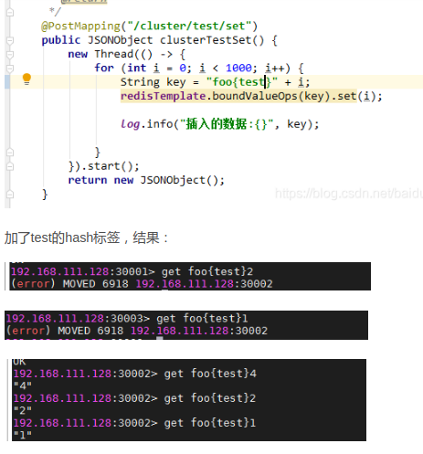

## Redis 有哪些架构模式？讲讲各自的特点
- 单机版
- 主从复制
- 哨兵模式（监控主从服务器，主服务器下线能够自动进行故障转移）
- 集群

## 主从复制
大概两个过程：
- 从节点发送sync给主节点，主节点发送rdb快照文件给从节点，从节点从快照文件同步数据
- 主节点每写一个命令就会同步到从节点，从节点接收并执行收到的命令

## 哨兵模式
一般使用3个哨兵，1主2从
### 作用
- 监控主节点和从节点的状态
- 当主节点发送故障，会自动将从节点转换为主节点，整个过程不需要人工参与
### 原理
- 哨兵节点会向所有主从节点和其他哨兵节点发送ping消息，如果主节点在一定时间内（down-after-milliseconds）没有得到回复，则会被哨兵节点标记为主观下线（SDOWN）。
- 当有足够数据量的哨兵节点标记主节点为主观下线，则主节点会标记为客观下线。
- 主节点会进行故障转移，选取一个从节点来替换主节点。
### 操作
准备节点：3个哨兵，1主，2从；
- 主从节点主要配置如下：
```bash
# 使得Redis服务器可以跨网络访问
bind 0.0.0.0
# 设置密码
requirepass "123456"
# 指定主服务器，注意：有关slaveof的配置只是配置从服务器，主服务器不需要配置
slaveof 192.168.11.128 6379
# 主服务器密码，注意：有关slaveof的配置只是配置从服务器，主服务器不需要配置
masterauth 123456
```
- 哨兵节点配置如下：
```bash
# 禁止保护模式
protected-mode no
# 配置监听的主服务器，这里sentinel monitor代表监控，mymaster代表服务器的名称，可以自定义，192.168.11.128代表监控的主服务器，6379代表端口，2代表只有两个或两个以上的哨兵认为主服务器不可用的时候，才会进行failover操作。
sentinel monitor mymaster 192.168.11.128 6379 2
# sentinel author-pass定义服务的密码，mymaster是服务名称，123456是Redis服务器密码
# sentinel auth-pass <master-name> <password>
sentinel auth-pass mymaster 123456
```
- 启动哨兵节点和主从节点
```bash
cd /data/wwwroot/redis/redis_sentinel
#启动redis
redis-server redis_6480/redis.conf #这个是主节点
redis-server redis_6481/redis.conf
redis-server redis_6482/redis.conf
#查看主从是否启动成功
redis-cli -h 127.0.0.1 -p 6480 ping
redis-cli -h 127.0.0.1 -p 6480 info replication
#启动哨兵
redis-sentinel sentinel_26379/sentinel.conf
redis-sentinel sentinel_26380/sentinel.conf
redis-sentinel sentinel_26381/sentinel.conf
#确认哨兵是否启用成功
redis-cli -p 26379 info sentinel
```

## 集群
redis的集群采用无中心结构，所有redis节点彼此互联（PING—PONG机制），当某个节点失败时需要集群中超过半数节点检测失效才会生效。客户端与redis节点直连，不需要借助中间代理层，客户端不需要连接集群所有节点,连接集群中任何一个可用节点即可。
### 集群数据分布
每一个节点负责维护一部分槽和槽存放的数据，槽的范围是0到16383
key -> 槽 -> 节点
### 集群请求路由
- 先计算key对应的槽，可以通过`cluster keyslot {key}`查看对应哪个槽
- 找槽对应的节点
- 若不是本节点，则回复move重定向错误，通知客户端请求正确的节点
cli模式下重定向，加上`-c`参数，例如`redis-cli -p 6481 -c`
### 如何解决集群mget问题？

集群带来的一个问题是，无法批处理，例如当我们提交了一批命令，往Redis中存储一批键，那么这些键一般会被映射到不同的slot，而不同的slot又可能在Redis Cluster中不同的节点上，这样就和的预期有点不同，有没有办法将这批键映射到同一个slot呢？

可以使用`hash_tag`，哈希标签是确保两个键都在同一个哈希槽里的一种方式。

- 比如这两个键 {user1000}.following 和 {user1000}.followers 会被哈希到同一个哈希槽里，因为只有 user1000 这个子串会被用来计算哈希值。
- 对于 foo{}{bar} 这个键，整个键都会被用来计算哈希值，因为第一个出现的 { 和它右边第一个出现的 } 之间没有任何字符。
- 对于 foo{bar}{zap} 这个键，用来计算哈希值的是 bar 这个子串，因为算法会在第一次有效或无效（比如中间没有任何字节）地匹配到 { 和 } 的时候停止。



### 集群是如何扩容?
- 添加新节点，`redis-trib.rb add-node new_host:new_port exitsing_host:existing_port` ，新加入节点刚开始都是主节点状态，没有负责槽，不能接收任何读写操作，需要导入槽和数据，或者是设置为从节点
- 迁移过程`redis-trib.rb reshard {existing_ip:existing_port}`
	- 目标节点准备导入槽
	- 源节点准备导出槽
	- 获取槽下n个key
	- 批量迁移相关key的数据
	- 循环迁移key
	- 通知槽分配给目标节点
- 新节点设置成从节点，具体进入从节点命令行，执行cluster replicate master_id

### 集群是如何缩容？
- 下线节点是否有负责的槽 ，如果有的话需要先迁移到其他节点上，命令`使用redis-trib.rb reshared {existing_ip:existing_port}`
- 当下线节点不再负责槽或者本身是从节点就可以通知集群其他节点忘记下线节点，命令`使用redis-trib.rb del-node {host:port} {downNodeId} 忘记节点`
- 下线节点正常关闭

### 集群是如何故障转移的？
- 首先，如果一个节点在规定时间内没有回复，会被其他节点标记为主观下线
- 如果被超过半数的节点标记为主观下线，则故障节点会被标为客观下线
- 资格检查；当从节点通过内部定时任务发现自身复制的主节点进入客观下线时，则会触发选举，触发条件：断线时间不超过`cluster-node-time*cluster-slave-validity-fator`，目的是剔除太久没有同步主节点数据的从节点
- 准备选举时间；一个故障主节点可能会有多个从节点，这就需要有发起选举的优先级，主要根据复制偏移量来设置延迟选举时间，复制偏移量越大，排名越靠前，延迟时间越低，越有机会才会主节点
- 选举投票；
	- 只有持有槽的主节点才能参与选举投票
	- 只有一个从节点获得n/2+1的选票才能选举成功
	- 在`clsuter-node-timeout*2`内从节点没有获取足够数量的投票，选举作废 
- 替换主节点，接管故障节点的槽和通知集群


### 迁移槽命令参数
`redis-trib.rb reshard {existing_ip:existing_port}`
- --slots 需要确定迁移槽的总数量，总槽数/总节点
- --from 多个源节点，迁出槽
- --to 一个目标节点，迁入槽
- --timeout 控制每次migrate操作的超时时间，默认为60000毫秒
- --pipeline 控制每次批量迁移键的数量，默认为10
- host:port 集群中任意一个节点的地址

## docker安装redis
```bash
docker run --name redis -p 6379:6379 redis
```

## 配置文件修改
```bash
port 6481
cluster-enabled yes
#集群内部配置文件
cluster-config-file nodes-6481.conf
#节点超时时间，单位毫秒
cluster-node-timeout 15000
logfile "/data/wwwroot/redis/redis_cluster/6481/log/redis-6481.log"
pidfile /data/wwwroot/redis/redis_cluster/redis-6481.pid
```

## 开始
```bash
#启动节点
redis-server /data/wwwroot/redis/redis_cluster/6481/redis-6481.conf
redis-server /data/wwwroot/redis/redis_cluster/6482/redis-6482.conf
redis-server /data/wwwroot/redis/redis_cluster/6483/redis-6483.conf
redis-server /data/wwwroot/redis/redis_cluster/6484/redis-6484.conf
redis-server /data/wwwroot/redis/redis_cluster/6485/redis-6485.conf
redis-server /data/wwwroot/redis/redis_cluster/6486/redis-6486.conf

redis-server /data/wwwroot/redis/redis_cluster/6487/redis-6487.conf
redis-server /data/wwwroot/redis/redis_cluster/6488/redis-6488.conf

#创建集群
#--replicas 1表示每个主节点配备几个从节点
redis-trib.rb create --replicas 1 127.0.0.1:6481 127.0.0.1:6482 127.0.0.1:6483 127.0.0.1:6484 127.0.0.1:6485 127.0.0.1:6486

#检测集群完整性
#只要16384个槽中有一个没有分配给节点则表示集群不完整
#可以对集群中任意一个节点发起检测
redis-trib.rb check 127.0.0.1:6481

#查看集群所有节点
cluster nodes

#集群扩容
#6487是新节点，6481是已存在节点
#如果新节点已存在数据，则会添加失败
#redis-trib.rb add-node {new_ip:new_port} {existing_ip:existing_port}
redis-trib.rb add-node 127.0.0.1:6487 127.0.0.1:6481
#迁移槽和数据，127.0.0.1:6481为集群中任意一个节点
redis-trib.rb reshard 127.0.0.1:6481

#集群缩容
#迁移槽
redis-trib.rb reshard 127.0.0.1:6481
#忘记节点
redis-trib.rb del-node 127.0.0.1:6487 d4aafc5465d0f85a55ccd648e045cedcb46478cd

#请求路由
#查看key对应的槽
cluster keyslot {key}
#cli模式下加上-c可以重定向到正确节点
redis-cli -p 6481 -c
```

## 新节点迁移槽和数据


## 日志输出
```bash
M: b079123bb42e1de36e9bc21d0473f8ceda6f7265 127.0.0.1:6481
   slots:0-5460 (5461 slots) master
   1 additional replica(s)
M: bcbb401d25543cfc6384546ad24b46eb264b426e 127.0.0.1:6483
   slots:10923-16383 (5461 slots) master
   1 additional replica(s)
S: 8f2f21cb11d1986da9137f099e938bdb4e0f230e 127.0.0.1:6484
   slots: (0 slots) slave
   replicates fa0015a21a575b170f5e39f463cc62fdb3a6e667
S: af886e91bf0f42e36627d16d35bc270c0b6fb35e 127.0.0.1:6486
   slots: (0 slots) slave
   replicates b079123bb42e1de36e9bc21d0473f8ceda6f7265
M: fa0015a21a575b170f5e39f463cc62fdb3a6e667 127.0.0.1:6482
   slots:5461-10922 (5462 slots) master
   1 additional replica(s)
S: 41e8cc7350b94185fca11ce243183f414307b037 127.0.0.1:6485
   slots: (0 slots) slave
   replicates bcbb401d25543cfc6384546ad24b46eb264b426e
[OK] All nodes agree about slots configuration.
>>> Check for open slots...
>>> Check slots coverage...
[OK] All 16384 slots covered.
```