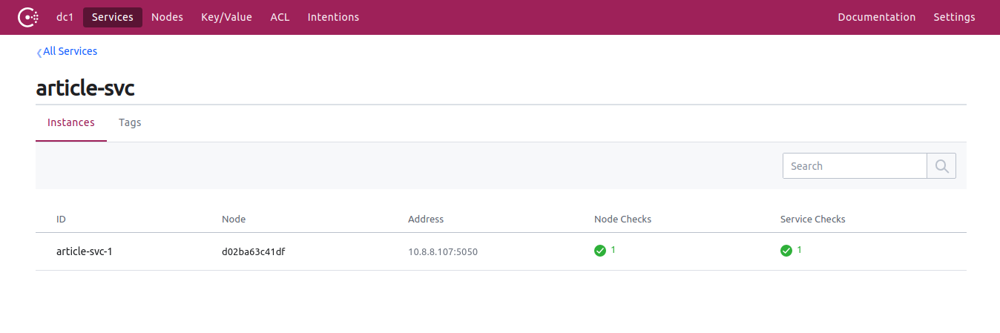

## consul
注册中心使用`consul`,我们的服务提供了`http`和`grpc`两种调用方式,我们需要把这两种方式的调用IP和port注册到`consul`


## 实现注册注销方式
### 注册http服务
```go

```

### 注册grpc服务


## 如何集成到项目中
`truss`脚手架生成入口文件为``


新建`consul`工具类,提供注册和注销两个功能
```go
RegService()
UnReService()
```

### 第二步
提供一个可以被`consul`访问的http接口,接口名称为`check`,该接口用于`consul`检测服务的健康状态,具体是服务提供`check`接口,响应内容为`{status:ok}`


```proto
//consul心跳检测
rpc Check(CheckRequest) returns (CheckResponse) {
    option (google.api.http) = {
    	get: "/check"
    };
}
message CheckRequest {
}
message CheckResponse {
    string status = 1;
}
```
自动生成代码
```bash
truss article.proto -svgout .
```
在handlers.go文件添加内容
```go
//consul心跳检测
func (s articleService) Check(ctx context.Context, in *pb.CheckRequest) (*pb.CheckResponse, error) {
	var resp pb.CheckResponse
	resp = pb.CheckResponse{Status: "ok"} //ok是consul要的结果
	return &resp, nil
}
```
修改完代码,重启下服务,看看接口是否可以访问,如下
```bash
curl -XGET http://127.0.0.1:5050/check
#返回ok表示接口可用了
{"status":"ok"}
```


注册到`consul`需要提供`id`,`name`,`addr`,`port`,各个参数说明如下:
- `id` 服务ID,唯一值,如果一个服务会部署多个节点的话,每个节点ID必须唯一
- `name` 服务名称,一个服务一个名称,即时多个节点`name`也是一样的
- `addr` 服务http地址,注意这个地址必须是`consul`能够访问到的,`consul`通过这个地址来检测服务是否健康状态
- `port` 服务端口




`article.proto`需要定义