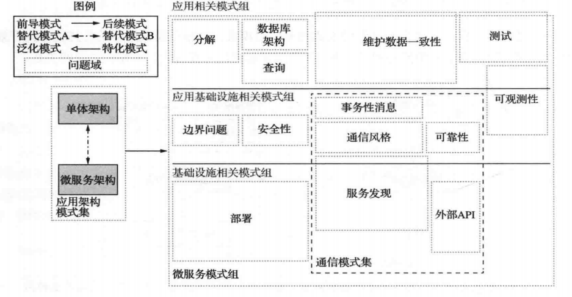

## 微服务
微服是将系统分解成一组可以独立部署的服务,每个服务都有自己的数据库,是大型复杂应用的更好选择

在什么阶段使用微服务
快速发展的业务和维护一个优雅架构之间的取舍,微服务架构使得项目开始阶段的快速迭代变得非常困难,需要认真思考的决策
大量的权衡和取舍

模式结构
- 需求
  - 松耦合
  - 独立部署
  - 易于扩展
- 结果上下文
  - 好处(解决了什么需求)
  - 弊端(没有解决什么需求)
  - 问题(使用这个模式会引入什么问题)
- 相关模式
	- 服务拆分的相关模式
	- 通信相关的相关模式
		- 使用rpc或http通信机制
		- 客户端如何获得服务具体实例(如http请求)的IP地址
		- 服务不可用,如何确保服务之间的可靠通信
		- 事务性消息,如何将消息发送,事件发布这样的动作与更新业务数据的数据库事务集成
		- 外部API,应用程序的客户端如何与服务进行通信 
	- 实现事务管理的数据一致性相关模式
		- 每个服务都有自己的数据库,必须使用saga模式来维护服务之间的数据一致性
	- 在微服务架构中查询数据的相关模式
		- 每个服务都有自己的数据库,不能使用left join方式来查询数据,逐一调用服务的API然后把所有的返回聚合在一起,常用命令查询职责隔离`CQRS`来维护一些重要和常用的查询数据视图
	- 服务部署相关模式
		- 高度自动化部署的基础设施
	- 可观测性相关模式(11章)
		- 健康检测API
		- 日志聚合,一个请求会在多个服务之间跳转,也就是看一个日志文件是解决不了问题的,将日志写入一个集中时的日志服务器,日志服务器可以提供日志搜索和触发报警
		- 分布式追踪,为每一个外部请求分配一个ID,用于各个服务之间追踪外部请求
		- 异常追踪
		- 应用指标
		- 审计日志,记录用户行为
	- 实现服务自动化测试的相关模式(9和10章)
		- 重点测试的是不同服务是否能够协同工作 
	- 解决基础设施和边界问题的相关模式
	- 安全相关的模式(11章)
		- 用户身份验证的工作通常由`API gateway`完成,然后再把有关用户的信息(身份和角色)传递给它调用的服务
		- 常见的解决方案是应用访问令牌模式,各个服务根据令牌获取用户的信息和角色 

`devOps`持续交付/持续部署

## 说明
文章参考于<<微服务架构设计模式>>第一章逃离单体地狱,内容经过本人的理解再加以简单的语言进行总结,如果有说错地方,望多多指正!