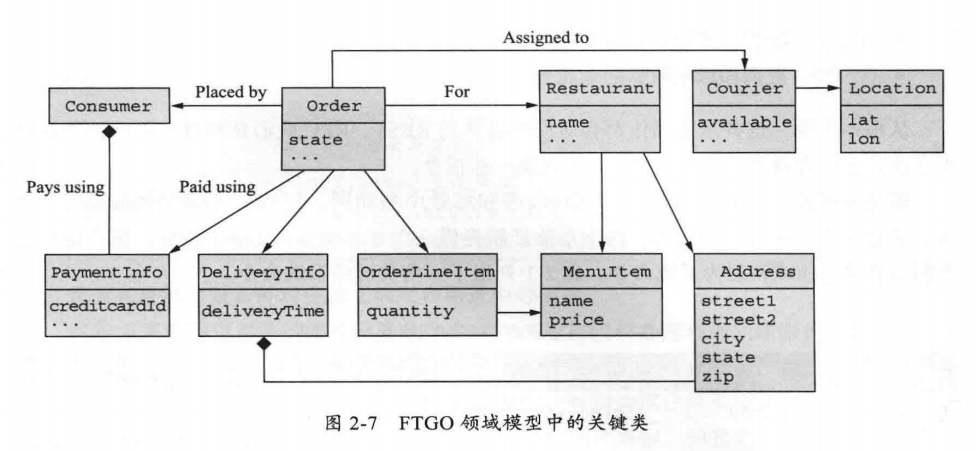

领域驱动设计DDD
架构的目的是可扩展性,可靠性和安全性, 微服务可为应用程序提供更高的可维护性,可测试性和可部署性

六边形结构风格

## 微服务架构
将应用程序构建为松耦合,可独立部署的一组服务

服务的一个基本要求是具有API并且可以独立部署

解决松耦合
微服务架构的最核心特性是服务之间的松耦合性,通过API来实现松耦合服务之间的协调调动,避免外界对服务的数据进行直接访问和调用

## 为应用程序定义微服务架构
- 定义系统操作,有哪些功能,一个系统操作代表一个外部请求(作业,作业的场景,增删改查,消息推送)
	- 由功能性需求定义抽象领域模型
	- 确定系统操作并根据领域模型描述每个操作系统的行为
	- 系统操作的类型?
		- 命令型(增删改)
		- 查询型(查) 
- 定义服务
- 定义服务API和协作方式

服务分解的障碍
- 网络延迟
- 同步通信减低可用性
- 维护跨服务的数据一致性
- 上帝类???

