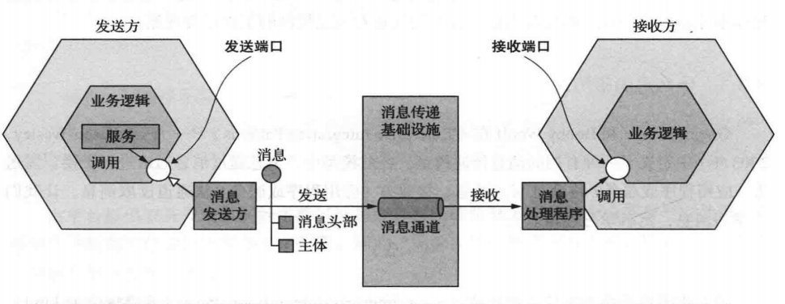

- 远程过程调用
- 断路器
- 客户端发现
- 自注册
- 服务端发现
- 第三方注册
- 异步消息
- 事务性发件箱
- 事务日志拖尾
- 轮询发布者

服务可以使用基于同步请求/响应的通信机制,或者使用异步的基于消息的通信机制
消息格式
- 可读性,如json,xml
- 更高效,如protobuf

交互方式的选择会影响应用程序的可用性

语义化版本控制
- major
- minor
- patch

消息格式
- 文本(json,xml,可读性,有利于对消息结构的修改,并且可以做到很好的向后兼容性,问题是过度冗长,解析文本引入的额外开销)
- 二进制(protobuf)

同步通信为什么会有局部故障问题???
调用一个服务或多个服务时,没有响应要怎么处理?
调用一个服务,肯定要指定服务的网络位置,如何知道?

远程调用
- rest api(有四个层次)
	- 很难将多个更新操作映射到http动词
	- 单个请求获取多个资源具有挑战性 
- grpc
	- 二进制消息格式,通过http2以`protocol buffer`格式交换二进制消息,高效

断路器
远程调用的代理,在连续失败次数超过指定阀值后一段时间内,这个代理会立即拒接其他调用
需要决定如何从失败的远程服务中恢复
- 网络超时
- 现在客户端向服务器发送请求的数量
- 断路器模式

服务发现
服务实例使用服务注册表注册其网络位置,客户端首先通过查询服务注册表获取服务实例表来调用服务,然后向其中一个实例发送请求
建议用平台提供的服务发现

基于异步消息模式的通信

- 点对点(一对一)
- 发布 - 订阅(一对多)

通过在请求消息中包含回复通道和消息标识来实现异步请求/响应,接收方处理消息并将回复发送到指定的回复通道

- 实现单向通知
- 实现发布/订阅
- 实现发布/异步响应

服务的异步API规范
- 必须指定消息通道的名称
- 消息类型
- 消息格式

如何保证消息顺序
- 消息队列通过分区消息通道来扩展接收方,确保消息被处理的顺序

处理重复消息
- 幂等消息处理程序
- 跟踪消息并丢弃重复项
- 消息接收方使用`message id`跟踪它已处理的消息并丢弃任何重复项,`message id`可以存放在单独表或者应用程序的数据库表

事务性消息
如何保证数据库更新和消息发布是在同一个事务中
- 使用数据库表作为消息队列
  
	- 将消息从数据库移动到消息代理并对外发送有两种不同的方法
		- 轮询数据库表(适合小规模场景)
		- 使用事务日志拖尾模式发布事件

消除同步交互
- 使用异步提交

- 复制数据,在复制数据量巨大的时候会导致效率低下

异步处理订单的过程,但是这样会增加客户端的复杂性,客户端需要自己去轮询状态或服务端通过短信通知来告知客户端,但是书中提到这是首先方案,还能解决分布式事务管理问题

