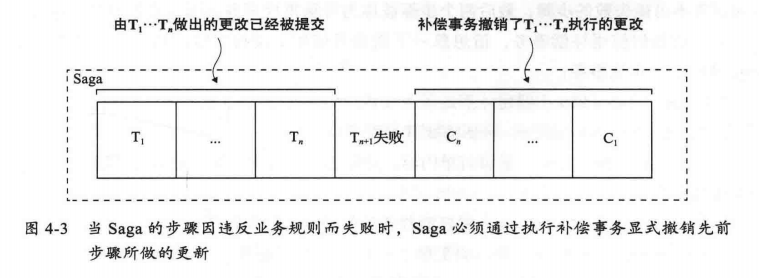

事务特性ACID
- 原子性
- 一致性
- 隔离性
- 持久性

Saga 一种消息驱动的本地事务序列,无法满足隔离性,协调`saga`有两种协调模式:
- 协同式,没有`集中控制器`的情况下交换事件式消息;把saga的决策和执行顺序逻辑分布在saga每一个参与方中,它们通过交换事件的方式来进行沟通
- 编排式,`集中控制器`告诉`saga`参与方要执行的操作; 把saga的决策和执行顺序逻辑分布在saga编排器中,编排器发出命令式消息给各个saga参与方,指示参与方的服务完成具体操作

微服务下事务管理巨大挑战
分布式事务管理的事实标准是`XA`,`XA`采用两阶段提交来保证事务中所有参与方同时完成提交,或者失败时同时回滚
- `mongodb`,`rabbitmq`,`kafka`不支持`xa`标准的分布式事务
- 为了让一个分布式事务完成提交,所有参与事务的服务都必须可用

`CAP`理论
- 一致性
- 可用性
- 分区容错性

消息系统中,把消息作为数据库事务的一部分,而不是采用分布式事务

saga是一种在微服务中维护数据一致性的机制,一个sage表示需要更新多个服务中数据的一个系统操作,它由一连串的本地事务组成; 总而言之,sage通过`异步消息`来协调一系列本地事务,从而维护多个服务之间的数据一致性.

saga的问题
- 缺乏隔离性
- 回滚更改(由于每个事务都提交了其更改,因此必须使用补偿事务回滚saga)

saga补偿事务

每个事务都需要对应一个补偿事务,当某个事务发生失败把,则以相反的顺序执行补偿事务

-e KAFKA_BROKER_ID=0  在kafka集群中，每个kafka都有一个BROKER_ID来区分自己
-e KAFKA_ZOOKEEPER_CONNECT=172.16.0.13:2181/kafka 配置zookeeper管理kafka的路径172.16.0.13:2181/kafka
-e KAFKA_ADVERTISED_LISTENERS=PLAINTEXT://172.16.0.13:9092  把kafka的地址端口注册给zookeeper，如果是远程访问要改成外网IP,类如Java程序访问出现无法连接。
-e KAFKA_LISTENERS=PLAINTEXT://0.0.0.0:9092 配置kafka的监听端口
-v /etc/localtime:/etc/localtime 容器时间同步虚拟机的时间

AccountFromContext

