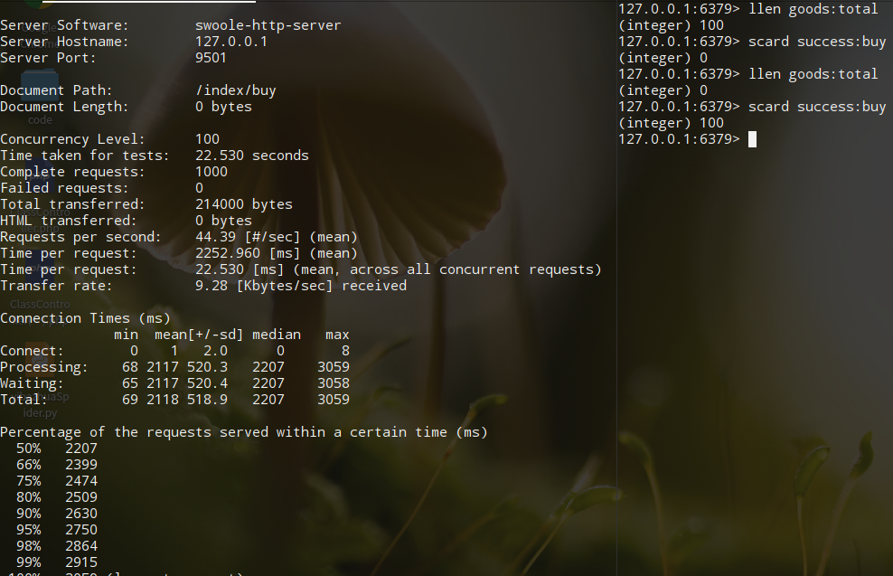

> 思路:讲产品总数初始化到redis列表中,抢购一个则从列表一个,直到列表数据为空;这里是因为redis是单进程单线程,并发访问会变成串行访问,所以不会出现超买的问题
```php
/**
 * 抢购初始化
 */
function buyingInit()
{
    global $redis;
    $redis->multi(Redis::PIPELINE);
    for ($i = 1; $i <= 100; $i++) {
        $redis->rPush('goods:total', $i);
    }
    $redis->exec();
}

/**
 * 抢购
 */
function buying()
{
    global $redis;
    $uid = rand(1, 200);
    $key = 'success:buy';

    if ($redis->lPop('goods:total')) {
        // 用集合保存用户ID，可以保证值是唯一的
        if (empty($redis->sAdd($key, $uid))) {
            // 如果sadd失败，则重新加入到goods:total队列
            $redis->rPush('goods:total', $uid);
        }
    } else {
        echo "empty \n";
    }
}
```
压力测试和结果: 
