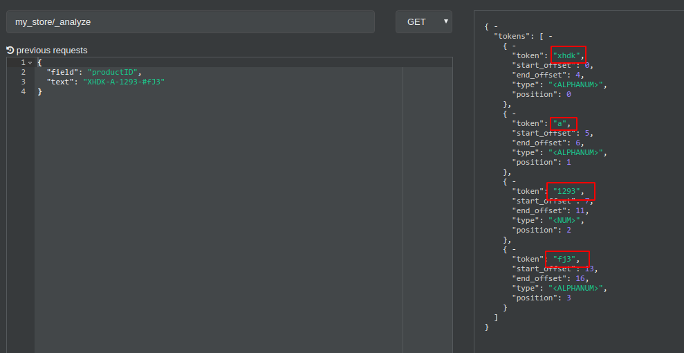
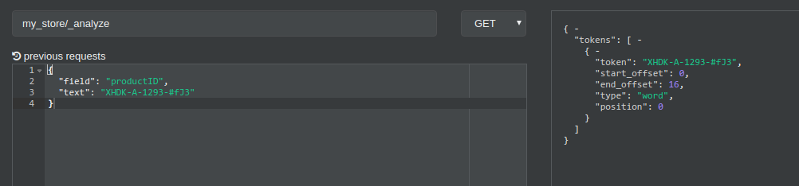
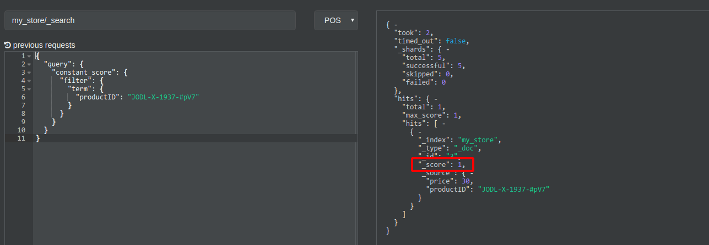
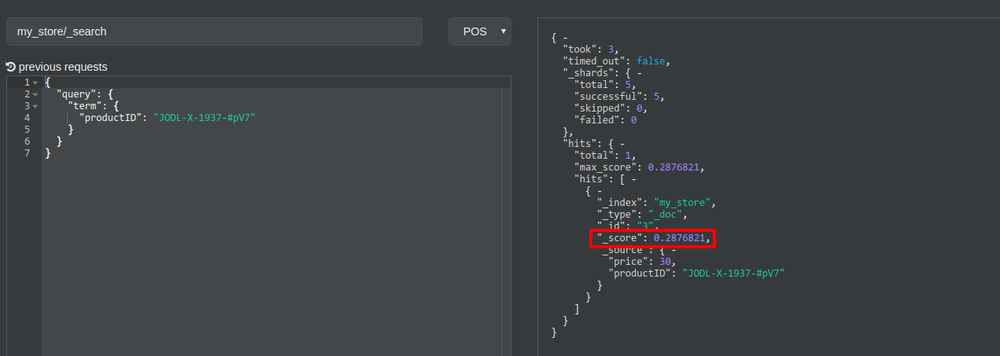

## api方式
```bash
索引/类型/api
```

普通搜索,返回结构
```json
{
    "took": 29,
    "timed_out": false,
    "_shards": {
        "total": 2,
        "successful": 2,
        "skipped": 0,
        "failed": 0
    },
    "hits": {
        "total": 1,
        "max_score": 0.5753642,
        "hits": [
            {
                "_index": "idx_item",
                "_type": "_doc",
                "_id": "NHjazHYBRqZRMz10dQS_",
                "_score": 0.5753642,
                "_source": {
                    "itemId": 2,
                    "title": "苏泊尔煲粥好能手型号SL322",
                    "desc": "你煲粥，我煲粥，我们一起让煲粥更简单",
                    "num": 100,
                    "price": 190
                }
            }
        ]
    }
}
```
- took：耗费了几毫秒
- timed_out：是否超时，这里是没有
- _shards：数据拆成了2个分片，所以对于搜索请求，会打到所有的primary shard（或者是它的某个replica shard也可以）
- hits.total：查询结果的数量，3个document
- hits.max_score：score的含义，就是document对于一个search的相关度的匹配分数，越相关，就越匹配，分数也高
- hits.hits：包含了匹配搜索的document的详细数据

为了配合本文的讲解，我们先导入一批数据
```bash
curl -H 'Content-type: application/x-ndjson' -XPOST 'http://127.0.0.1:9200/my_store/_doc/_bulk' -d '{"index":{"_id":1}}
{"price":10,"productID":"XHDK-A-1293-#fJ3"}
{"index":{"_id":2}}
{"price":20,"productID":"KDKE-B-9947-#kL5"}
{"index":{"_id":3}}
{"price":30,"productID":"JODL-X-1937-#pV7"}
{"index":{"_id":4}}
{"price":30,"productID":"QQPX-R-3956-#aD8"}
'
```

## 精确查找 term
使用`match`搜索文本时，`es`会先将文本进行分词，然后将分词后多个关键字再去搜索，而`term`则不会先去分词，直接将文本原封不动的去搜索，如下：
```json
{
    "query": {
        "term": {
            "productID": "JODL-X-1937-#pV7"
        }
    }
}
```
上面的语句会精确搜索`JODL-X-1937-#pV7`,但是当我们执行上面查询语句时,并没有得到期望的结果,原因是我们在导入的数据时`productID`先被分词之后再保存在es,可以通过`_analyze`查看`es`实际存储`productID`的文本,例如:
```bash
curl -X GET "127.0.0.1:9200/my_store/_analyze?pretty" -H 'Content-Type: application/json' -d'
{
  "field": "productID",
  "text": "XHDK-A-1293-#fJ3"
}
'
```

如图所示，`XHDK-A-1293-#fJ3`在导入数据的时候被拆分成了多个关键字，如果用`XHDK-A-1293-#fJ3`来进行匹配，肯定无法匹配到数据。那么我们要怎么才能在导入的时候不让文本分词，我们可以将`productID`设置为`keyword`类型，现在让我们来重新创建映射`mapping`，如下

```bash
#删除索引，删除索引是必须的，因为我们不能更新已存在的映射
curl -H 'Content-type: application/json' -XDELETE 'http://127.0.0.1:9200/my_store'

#重新创建mapping
curl -H 'Content-type: application/json' -XPUT 'http://127.0.0.1:9200/my_store' -d '{
 "mappings": {
  "_doc": {
   "properties": {
    "productID": {
     "type": "keyword", //1
     "ignore_above": 64
    }
   }
  }
 }
}'
- //1 设置`productID`为`keyword`类型

#再次重新导入数据
curl -H 'Content-type: application/x-ndjson' -XPOST 'http://127.0.0.1:9200/my_store/_doc/_bulk' -d '{"index":{"_id":1}}
{"price":10,"productID":"XHDK-A-1293-#fJ3"}
{"index":{"_id":2}}
{"price":20,"productID":"KDKE-B-9947-#kL5"}
{"index":{"_id":3}}
{"price":30,"productID":"JODL-X-1937-#pV7"}
{"index":{"_id":4}}
{"price":30,"productID":"QQPX-R-3956-#aD8"}
'
```
执行上上面步骤之后，我们再看看是否导入时候被分词了

最后,我们再执行下`term`查询,已经可以找到数据了

## constant_score非评分模式查询
貌似用处不大
es的搜索结果是带有`_score`,用于判定搜索结果的权重,如果我们只是简单的希望对文档进行包括或排除的计算,可以使用`constant_score`非评分模式来查询,因为不计算评分,速度会相对快一些
```bash
curl -H 'Content-type: application/json' -XPOST 'http://es6.5.4:9200/my_store/_search' -d '{
 "query": {
  "constant_score": {
   "filter": {
    "term": {
     "productID": "JODL-X-1937-#pV7"
    }
   }
  }
 }
}'
```
`constant_score`一般配合过滤器`filter`使用,查询置于 filter 语句内不进行评分或相关度的计算，所以所有的结果都会返回一个默认评分 1,对比一下下面的执行结果就可以知道了




## 布尔bool查询
一个 bool查询由四部分组成：
```bash
{
   "bool" : {
      "must" :     [], //等价于and,必须匹配。贡献算分
      "should" :   [], //等价于or,选择性匹配，至少满足一条。贡献算分
      "must_not" : [], //等价于not,过滤子句，必须不能匹配，但不贡献算分
      "filter": [], //过滤子句，必须匹配，但不贡献算分
   }
}
```
bool四部分可以随意出现,并排关系为and关系


接下来我们以例子为例
```sql
SELECT product
FROM   products
WHERE  (price = 20 OR productID = "XHDK-A-1293-#fJ3") 
AND  (price != 30)
```
这是一条查询产品价格不等于30并且价格为20或者productID为XHDK-A-1293-#fJ3的sql,我们用`bool`来实现它
```json
{
    "query": {
        "bool": {
            "must_not": { //1
                "term": {
                    "price": 30
                } 
            },
            "should": [ //2
                 { "term" : {"price" : 20}}, 
                 { "term" : {"productID" : "XHDK-A-1293-#fJ3"}} 
            ]
        }
    }
}
```
- //1 实现`price != 30`条件
- //2 实现`price = 20 OR productID = "XHDK-A-1293-#fJ3"`条件


```sql
SELECT document
FROM   products
WHERE  productID = "KDKE-B-9947-#kL5"
OR ( productID = "JODL-X-1937-#pV7" AND price = 30 )
```
使用es查询如下:
```json
{
    "query": {
        "bool": {
            "should": [ //1
                {
                	"term": {"productID": "KDKE-B-9947-#kL5"} //2
                },
                {
                    "bool": {
                        "must": [ //3
                            {
                                "term": {"productID": "JODL-X-1937-#pV7"}
                            },
                        	{
                                "term": {"price":30}
                        	}
                        ]
                    }
                }
            ]
        }
    }
}
```
- //1 实现`or`关系
- //2 实现`productID = "KDKE-B-9947-#kL5"`条件
- //3 实现`productID = "JODL-X-1937-#pV7" AND price = 30`条件

## 搜索几种方式

- 1、query string search
- 2、query DSL
- 3、query filter
- 4、full-text search
- 5、phrase search
- 6、highlight search

### 1、query string search
格式:
```
q=+field:keyword&sort=field:desc
```
例如游览器输入如下url
```bash
//搜索title为炸鸡并且根据价格倒序显示
http://127.0.0.1:9200/idx_item/_search?q=title:炸鸡&sort=price:desc

//+号表示搜索结果包含炸鸡, -号表示搜索结果不要包含炸鸡的
http://127.0.0.1:9200/idx_item/_search?q=title:+炸鸡

//如果不指定field,则搜索所有field包含炸鸡的数据
http://127.0.0.1:9200/idx_item/_search?q=炸鸡
```

### 2、query DSL
即用json的格式来构建查询语法,如下:
```bash
curl -H 'Content-type: application/json' -XGET 'http://es6.5.4:9200/idx_item/_search'
{
  "query": {
    "match": {
      "title": "煲粥"
    }
  }
}
```

#### 分页查询
```
{
  "query": {
    "match": {
      "title": "煲粥"
    }
  },
  "from": 1, //从第几个产品开始查询
  "size": 10,
  "_source": ["title","price"], //指定要查询出来商品的名称和价格就可以
}
```

#### Scoll滚动搜索
有点类似于游标功能,例如如果一次性要查出来比如10万条数据，那么性能会很差，此时一般会采取用scoll滚动查询，一批一批的查，直到所有数据都查询完处理完
???

## 组合搜索
### 1、match all
```json
{
    "query": {
        "match_all": {}
    }
}
```

### 2、match
```json
{
  "query": {
    "match": {
      "title": "苏泊尔"
    }
  }
}
```

### 3、multi match
```json
{
  "query": {
    "multi_match": {
      "query": "煲粥",
      "fields": [
        "title",
        "desc"
      ]
    }
  }
}
```

### 4、range query 
```json
{
  "query": {
    "range": {
      "price": {
        "gte": 0
      }
    }
  }
}
```

### 5、term query  
```json
{
  "query": {
    "term": {
      "title.keyword": "苏泊尔煮饭SL3200"
    }
  }
}
```
不分词查询,一般用于keyword类型查询

### 6、terms query
```json
{
  "query": {
    "terms": {
      "title.keyword": ["苏泊尔煮饭SL3200","苏泊尔煲粥好能手型号SL322"]
    }
  }
}
```
不分词查询,同时搜索多个keyword

### 过滤
```json
{
  "query": {
    "bool": {
      "must": {
        "terms": {
          "title.keyword": [
            "苏泊尔煮饭SL3200",
            "苏泊尔煲粥好能手型号SL322"
          ]
        }
      },
      "filter": {
          "range": {
            "price": {
              "gte": 190
            }
          }
        }
    }
  }
}
```

### phrase search（短语搜索）
```json
{
  "query": {
    "match_phrase": {
      "title": "苏泊尔"
    }
  }
}
```

### 高亮显示
```json
{
  "query": {
    "match_phrase": {
      "title": "苏泊尔"
    }
  },
  "highlight": {
    "fields": {
      "title": {}
    }
  }
}
```

## 参考
- https://www.cnblogs.com/kesimin/p/9559927.html
- https://www.elastic.co/guide/cn/elasticsearch/guide/current/_filtering_queries.html


