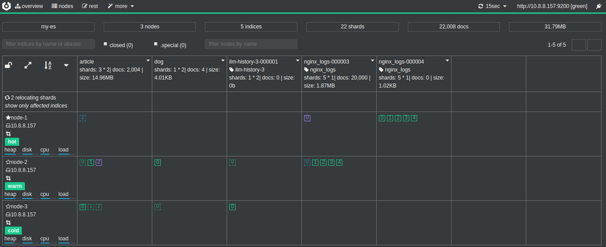
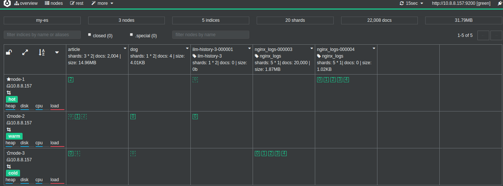
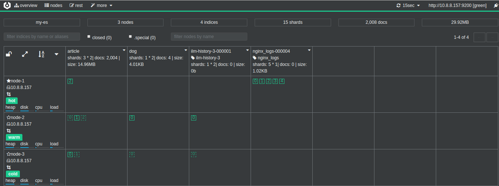

## 理论基础

- 为什么索引会有生命？什么是索引生命周期？
- ILM 是如何划分索引生命周期的？
- ILM 是如何管理索引生命周期的？

### **问题1：为什么索引有生命？** 

 答：这就要从 Elasticsearch 的应用场景来看了。

​      在`业务搜索`场景，用户会将业务数据存储在 Elasticsearch 中，比如商品数据、订单数据、用户数据等，实现快速的全文检索功能。像这类数据基本都是累加的，不会删除。一般删除的话，要么是业务升级，要么是业务歇菜了。此种场景下，基本只有生，没有死，也就不存在管理一说。

​       而在`日志业务`场景中，用户会将各种日志，如系统、防火墙、中间件、数据库、web 服务器、应用日志等全部实时地存入 Elasticsearch 中，进行即席日志查询与分析。这种类型的数据都会有时间维度，也就是时序性的数据。由于日志的数据量过大，用户一般不会存储全量的数据，一般会在 Elasticsearch 中存储热数据，比如最近7天、30天的数据等，而在7天或者30天之前的数据都会被`删除`。为了便于操作，用户一般会按照日期来建立索引，比如 nginx 的日志索引名可能为 `nginx_log-2018.11.12`、`nginx_log-2018.11.13`等，当要查询或删除某一天的日志时，只需要针对对应日期的索引做操作就可以了。那么在该场景下，每天都会上演大量索引的生与死。

一个索引由生到死的过程，即为一个生命周期。举例如下：

- 生：在 `2019年2月5日` 创建 `nginx_log-2019.02.05`的索引，开始处理日志数据的读写请求
- 生：在 `2019年2月6日` `nginx_log-2019.02.05` 索引便不再处理写请求，只处理读请求
- 死：在 `2019年3月5日` 删除 `nginx_log-2018.02.05`的索引

其他的索引，如 `nginx_log-2019.02.06` 等也会经过相同的一个生命周期。

### **ILM 是如何划分索引生命周期的？** 

答：ILM 一共将索引生命周期分为四个阶段(Phase)：

1. Hot 阶段
2. Warm 阶段
3. Cold 阶段
4. Delete 阶段

### **问题3.：ILM 是如何管理索引生命周期的？**

答：所谓生命周期的管理就是控制 4 个生命阶段转换，何时由 Hot 转为 Warm，何时由 Warm 转为 Cold，何时 Delete 等。

阶段的转换必然是需要时机的，而对于时序数据来说，时间必然是最好的维度，而 ILM 也是以时间为转换的衡量单位。比如下面这张转换的示意图，即默认是 Hot 阶段，在**索引创建** 3 天后转为 Warm 阶段，7 天后转为 Cold 阶段，30 天后删除。这个设置的相关字段为 `min_age`，后文会详细讲解。ILM 将不同的生命周期管理策略称为 `Policy`，而所谓的 `Policy` 是由不同阶段(`Phase`)的不同动作(`Action`)组成的。`Action`是一系列操作索引的动作，比如 Rollover、Shrink、Force Merge等，不同阶段可用的 `Action` 不同，详情如下：

Hot Phase
- Rollover 滚动索引操作，可用在索引大小或者文档数达到某设定值时，创建新的索引用于数据读写，从而控制单个索引的大小。这里要注意的一点是，如果启用了 Rollover，那么所有阶段的时间不再以索引创建时间为准，而是以该索引 Rollover 的时间为准。

Warm Phase
- Allocate 设定副本数、修改分片分配规则(如将分片迁移到中等配置的节点上)等
- Read-Onlly 设定当前索引为只读状态
- Force Merge 合并 segment 操作
- Shrink 缩小 shard 分片数

Cold Phase

- Allocate 同上

Delete Phase

- Delete 删除

 

## 实战

**1、目标**

现在需要收集 nginx 日志，只需保留最近`30天`的日志，但要保证最近`7天`的日志有良好的查询性能，搜索响应时间在 `100ms` 以内。

为了让大家可以快速看到效果，下面实际操作的时候会将 `30天`、`7天` 替换为 `40秒`、`20秒`。

**2、ES 集群架构**

这里我们简单介绍下这次实战所用 ES 集群的构成。该 ES 集群一共有 3个节点组成，每个节点都有名为 `box_type` 的属性，如下所示：

```
curl -X GET "localhost:9200/_cat/nodeattrs?v=true&pretty"
es01_hot  172.24.0.5 172.24.0.5 box_type          hot
es02_warm 172.24.0.4 172.24.0.4 box_type          warm
es03_cold 172.24.0.3 172.24.0.3 box_type          cold
```

由上可见我们有 1 个 hot 节点、1 个 warm 节点、1 个 cold 节点，分别用于对应 ILM 的阶段，即 Hot 阶段的索引都位于 hot 上，Warm 阶段的索引都位于 warm 上，Cold 阶段的索引都位于 cold 上。

**3、创建 ILM Policy**

根据要求，我们的 Policy 设定如下：

- 索引名以 nginx_logs 为前缀，且以每10个文档做一次 Rollover
- Rollover 后 5 秒转为 Warm 阶段
- Rollover 后 20 秒转为 Cold 阶段
- Rollover 后 40 秒删除 

```
#创建ILM
curl -XPUT "localhost:9200/_ilm/policy/nginx_ilm_policy" -H 'Content-Type: application/json' -d'
{
  "policy": {
    "phases": {
      "hot": {
        "actions": {
          "rollover": {
            "max_docs": "10"
          }
        }
      },
      "warm": {
        "min_age": "5s",
        "actions": {
          "allocate": {
            "include": {
              "box_type": "warm"
            }
          }
        }
      },
      "cold": {
        "min_age": "20s",
        "actions": {
          "allocate": {
            "include": {
              "box_type": "cold"
            }
          }
        }
      },
      "delete": {
        "min_age": "40s",
        "actions": {
          "delete": {}
        }
      }
    }
  }
}
'
```

**4、创建 Index Template**

我们基于索引模板来创建所需的索引，如下所示：

```
 
#创建模板，关联索引和ILM策略
curl -XPUT "localhost:9200/_template/nginx_ilm_template" -H 'Content-Type: application/json' -d'
{
  "index_patterns": ["nginx_logs-*"],                 
  "settings": {
    "number_of_shards": 5,
    "number_of_replicas": 0,
    "index.lifecycle.name": "nginx_ilm_policy",      
    "index.lifecycle.rollover_alias": "nginx_logs",
    "index.routing.allocation.include.box_type": "hot"
  }
}
'
```

上述配置解释如下：

- index.lifecycle.name 指明该索引应用的 ILM Policy
- index.lifecycle.rollover_alias 指明在 Rollover 的时候使用的 alias
- index.routing.allocation.include.box_type 指明新建的索引都分配在 hot 节点上

 **5、创建初始索引 Index**

 ILM 的第一个索引需要我们手动来创建，另外启动 Rollover 必须以数值类型结尾，比如 `nginx_logs-000001`。索引创建的 api 如下：

```
#创建索引
curl -XPUT "localhost:9200/nginx_logs-000001" -H 'Content-Type: application/json' -d'
{
  "aliases": {
    "nginx_logs": {
      "is_write_index":true
    }
  }
}
'
```

**6、修改 ILM Polling Interval**

 ILM Service 会在后台轮询执行 Policy，默认间隔时间为 10 分钟，为了更快地看到效果，我们将其修改为 1 秒

```
#修改轮询时间，ILM Service 会在后台轮询执行 Policy，默认间隔时间为 10 分钟，为了更快地看到效果，我们将其修改为 1 秒。
curl -XPUT "localhost:9200/_cluster/settings" -H 'Content-Type: application/json' -d'
{
  "persistent": {
    "indices.lifecycle.poll_interval":"1s"
  }
}
'
```

**7、批量写入数据**

<https://github.com/oliver006/elasticsearch-test-data>

```bash
python es_data_gen.py --es_url=http://localhost:9200 --index_name=nginx_logs --num_of_shards=5 --num_of_replicas=0 --count=10000
```


**8、观察数据流转**

命令观察可以执行如下，需要每隔几秒执行一下

```bash
curl localhost:9200/_cat/shards
```

或者观察ui界面，如下图所示，数据从hot到warm再到cold，最后被删除，然后会自动新建索引`nginx_logs-00004`，旧索引`nginx_logs-000003`最总会被删除





### 最后再清除测试数据

```bash
curl -XDELETE localhost:9200/nginx* && curl -XDELETE localhost:9200/_template/nginx_ilm_template && curl -XDELETE localhost:9200/_ilm/policy/nginx_ilm_policy
```

