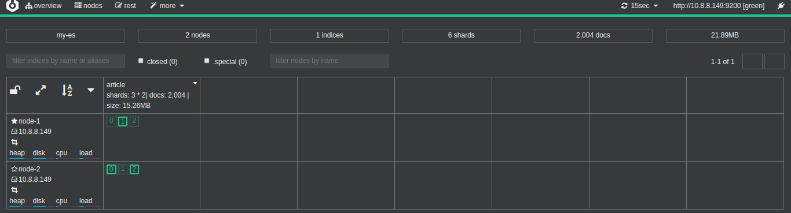
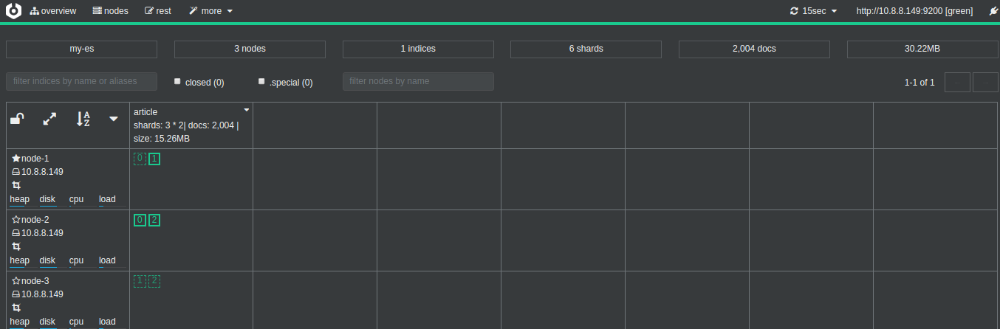
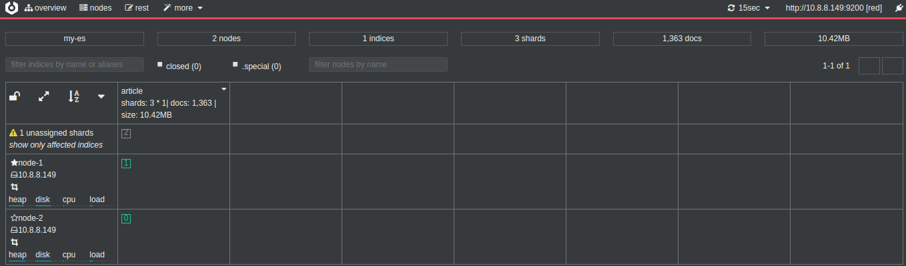
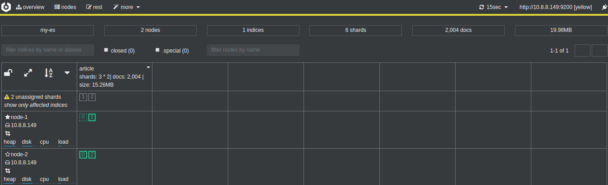
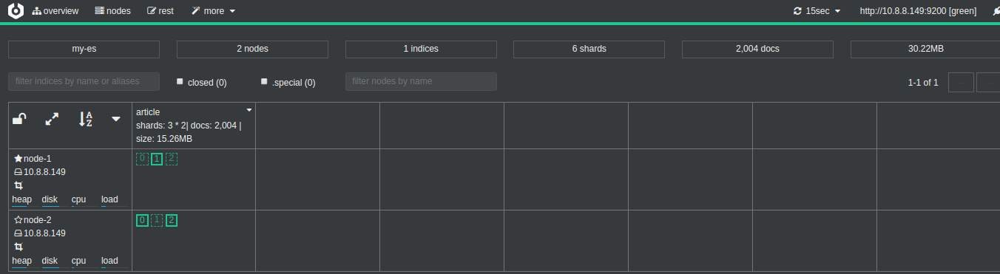

## 使用docker部署集群
### 设置Elasticsearch挂载目录

```bash
#存放配置文件的文件夹
mkdir -p /data/wwwroot/elk/es-cluster/node-1/config
mkdir -p /data/wwwroot/elk/es-cluster/node-2/config
mkdir -p /data/wwwroot/elk/es-cluster/node-3/config
#存放数据的文件夹
mkdir -p /data/wwwroot/elk/es-cluster/node-1/data
mkdir -p /data/wwwroot/elk/es-cluster/node-2/data
mkdir -p /data/wwwroot/elk/es-cluster/node-3/data
#存放运行日志的文件夹
mkdir -p /data/wwwroot/elk/es-cluster/node-1/log
mkdir -p /data/wwwroot/elk/es-cluster/node-2/log
mkdir -p /data/wwwroot/elk/es-cluster/node-3/log
#存放IK分词插件的文件夹
mkdir -p /data/wwwroot/elk/es-cluster/node-1/plugins
mkdir -p /data/wwwroot/elk/es-cluster/node-2/plugins
mkdir -p /data/wwwroot/elk/es-cluster/node-3/plugins
#设置权限
chmod 777 /data/wwwroot/elk/es-cluster/node-1/data
chmod 777 /data/wwwroot/elk/es-cluster/node-2/data
chmod 777 /data/wwwroot/elk/es-cluster/node-3/data
chmod 777 /data/wwwroot/elk/es-cluster/node-1/log
chmod 777 /data/wwwroot/elk/es-cluster/node-2/log
chmod 777 /data/wwwroot/elk/es-cluster/node-3/log
chmod 777 /data/wwwroot/elk/es-cluster/node-1/config
chmod 777 /data/wwwroot/elk/es-cluster/node-3/config
chmod 777 /data/wwwroot/elk/es-cluster/node-2/config
chmod 777 /data/wwwroot/elk/es-cluster/node-1/plugins
chmod 777 /data/wwwroot/elk/es-cluster/node-2/plugins
chmod 777 /data/wwwroot/elk/es-cluster/node-3/plugins
```

### 创建多个yml至data目录中

三个配置不同之处为node.name，设置映射端口，设置内部通讯端口，由于我们是放置在**docker**上部署，所以物理机相同，但是端口需要改变。部署的时候最好将注释的中文以及无用的特殊字符删除，因为有可能会抛出异常

#### 创建node-1的YML文件

```
#集群名称
cluster.name: my-es
#当前该节点的名称
node.name: node-1
#是不是有资格竞选主节点
node.master: true
#是否存储数据
node.data: true
#最大集群节点数
node.max_local_storage_nodes: 3
#给当前节点自定义属性（可以省略）
#node.attr.rack: r1
#数据存档位置
path.data: /usr/share/elasticsearch/data
#日志存放位置
path.logs: /usr/share/elasticsearch/log
#是否开启时锁定内存（默认为是）
#bootstrap.memory_lock: true
#设置网关地址，我是被这个坑死了，这个地址我原先填写了自己的实际物理IP地址，
#然后启动一直报无效的IP地址，无法注入9300端口，这里只需要填写0.0.0.0
network.host: 0.0.0.0
#设置其它结点和该结点交互的ip地址，如果不设置它会自动判断，值必须是个真实的ip地址，设置当前物理机地址,
#如果是docker安装节点的IP将会是配置的IP而不是docker网管ip
network.publish_host: 127.0.0.1
#设置映射端口
http.port: 9200
#内部节点之间沟通端口
transport.tcp.port: 9300
#集群发现默认值为127.0.0.1:9300,如果要在其他主机上形成包含节点的群集,如果搭建集群则需要填写
#es7.x 之后新增的配置，写入候选主节点的设备地址，在开启服务后可以被选为主节点，也就是说把所有的节点都写上
discovery.seed_hosts: ["127.0.0.1:9300","127.0.0.1:9301","127.0.0.1:9302"]
#当你在搭建集群的时候，选出合格的节点集群，有些人说的太官方了，
#其实就是，让你选择比较好的几个节点，在你节点启动时，在这些节点中选一个做领导者，
#如果你不设置呢，elasticsearch就会自己选举，这里我们把三个节点都写上
cluster.initial_master_nodes: ["node-1","node-2","node-3"]
#在群集完全重新启动后阻止初始恢复，直到启动N个节点
#简单点说在集群启动后，至少复活多少个节点以上，那么这个服务才可以被使用，否则不可以被使用，
gateway.recover_after_nodes: 2
#删除索引是是否需要显示其名称，默认为显示
#action.destructive_requires_name: true
```

#### 创建node-2的YML文件

```
#集群名称
cluster.name: my-es
#当前该节点的名称
node.name: node-2
#是不是有资格竞选主节点
node.master: true
#是否存储数据
node.data: true
#最大集群节点数
node.max_local_storage_nodes: 3
#给当前节点自定义属性（可以省略）
#node.attr.rack: r1
#数据存档位置
path.data: /usr/share/elasticsearch/data
#日志存放位置
path.logs: /usr/share/elasticsearch/log
#是否开启时锁定内存（默认为是）
#bootstrap.memory_lock: true
#设置网关地址，我是被这个坑死了，这个地址我原先填写了自己的实际物理IP地址，
#然后启动一直报无效的IP地址，无法注入9300端口，这里只需要填写0.0.0.0
network.host: 0.0.0.0
#设置其它结点和该结点交互的ip地址，如果不设置它会自动判断，值必须是个真实的ip地址，设置当前物理机地址,
#如果是docker安装节点的IP将会是配置的IP而不是docker网管ip
network.publish_host: 127.0.0.1
#设置映射端口
http.port: 9201
#内部节点之间沟通端口
transport.tcp.port: 9301
#集群发现默认值为127.0.0.1:9300,如果要在其他主机上形成包含节点的群集,如果搭建集群则需要填写
#es7.x 之后新增的配置，写入候选主节点的设备地址，在开启服务后可以被选为主节点，也就是说把所有的节点都写上
discovery.seed_hosts: ["127.0.0.1:9300","127.0.0.1:9301","127.0.0.1:9302"]
#当你在搭建集群的时候，选出合格的节点集群，有些人说的太官方了，
#其实就是，让你选择比较好的几个节点，在你节点启动时，在这些节点中选一个做领导者，
#如果你不设置呢，elasticsearch就会自己选举，这里我们把三个节点都写上
cluster.initial_master_nodes: ["node-1","node-2","node-3"]
#在群集完全重新启动后阻止初始恢复，直到启动N个节点
#简单点说在集群启动后，至少复活多少个节点以上，那么这个服务才可以被使用，否则不可以被使用，
gateway.recover_after_nodes: 2
#删除索引是是否需要显示其名称，默认为显示
#action.destructive_requires_name: true
```

#### 创建node-3的YML文件

```
#集群名称
cluster.name: my-es
#当前该节点的名称
node.name: node-3
#是不是有资格竞选主节点
node.master: true
#是否存储数据
node.data: true
#最大集群节点数
node.max_local_storage_nodes: 3
#给当前节点自定义属性（可以省略）
#node.attr.rack: r1
#数据存档位置
path.data: /usr/share/elasticsearch/data
#日志存放位置
path.logs: /usr/share/elasticsearch/log
#是否开启时锁定内存（默认为是）
#bootstrap.memory_lock: true
#设置网关地址，我是被这个坑死了，这个地址我原先填写了自己的实际物理IP地址，
#然后启动一直报无效的IP地址，无法注入9300端口，这里只需要填写0.0.0.0
network.host: 0.0.0.0
#设置其它结点和该结点交互的ip地址，如果不设置它会自动判断，值必须是个真实的ip地址，设置当前物理机地址,
#如果是docker安装节点的IP将会是配置的IP而不是docker网管ip
network.publish_host: 127.0.0.1
#设置映射端口
http.port: 9202
#内部节点之间沟通端口
transport.tcp.port: 9302
#集群发现默认值为127.0.0.1:9300,如果要在其他主机上形成包含节点的群集,如果搭建集群则需要填写
#es7.x 之后新增的配置，写入候选主节点的设备地址，在开启服务后可以被选为主节点，也就是说把所有的节点都写上
discovery.seed_hosts: ["127.0.0.1:9300","127.0.0.1:9301","127.0.0.1:9302"]
#当你在搭建集群的时候，选出合格的节点集群，有些人说的太官方了，
#其实就是，让你选择比较好的几个节点，在你节点启动时，在这些节点中选一个做领导者，
#如果你不设置呢，elasticsearch就会自己选举，这里我们把三个节点都写上
cluster.initial_master_nodes: ["node-1","node-2","node-3"]
#在群集完全重新启动后阻止初始恢复，直到启动N个节点
#简单点说在集群启动后，至少复活多少个节点以上，那么这个服务才可以被使用，否则不可以被使用，
gateway.recover_after_nodes: 2
#删除索引是是否需要显示其名称，默认为显示
#action.destructive_requires_name: true
```

### 安装并启动容器 

```bash
docker run -e ES_JAVA_OPTS="-Xms256m -Xmx256m" --network es_esnet -p 9200:9200 -p 9300:9300 -v /data/wwwroot/elk/es-cluster/node-1/config/elasticsearch.yml:/usr/share/elasticsearch/config/elasticsearch.yml -v /data/wwwroot/elk/es-cluster/node-1/plugins:/usr/share/elasticsearch/plugins -v /data/wwwroot/elk/es-cluster/node-1/data:/usr/share/elasticsearch/data -v /data/wwwroot/elk/es-cluster/node-1/log:/usr/share/elasticsearch/log --name es-node-1 docker.elastic.co/elasticsearch/elasticsearch:7.10.1

docker run -e ES_JAVA_OPTS="-Xms256m -Xmx256m" --network es_esnet -p 9201:9201 -p 9301:9301 -v /data/wwwroot/elk/es-cluster/node-2/config/elasticsearch.yml:/usr/share/elasticsearch/config/elasticsearch.yml -v /data/wwwroot/elk/es-cluster/node-2/plugins:/usr/share/elasticsearch/plugins -v /data/wwwroot/elk/es-cluster/node-2/data:/usr/share/elasticsearch/data -v /data/wwwroot/elk/es-cluster/node-2/log:/usr/share/elasticsearch/log --name es-node-2 docker.elastic.co/elasticsearch/elasticsearch:7.10.1

docker run -e ES_JAVA_OPTS="-Xms256m -Xmx256m" --network es_esnet -p 9202:9202 -p 9302:9302 -v /data/wwwroot/elk/es-cluster/node-3/config/elasticsearch.yml:/usr/share/elasticsearch/config/elasticsearch.yml -v /data/wwwroot/elk/es-cluster/node-3/plugins:/usr/share/elasticsearch/plugins -v /data/wwwroot/elk/es-cluster/node-3/data:/usr/share/elasticsearch/data -v /data/wwwroot/elk/es-cluster/node-3/log:/usr/share/elasticsearch/log --name es-node-3 docker.elastic.co/elasticsearch/elasticsearch:7.10.1
```

### 参考

<https://blog.csdn.net/gfk3009/article/details/104560431/>


## 问题

### 原本两个节点，3个主分片3个福分配，当再新增一个个节点时，分片会怎么样在三个节点分布？
一个节点可以同时分配两个主分片，如下图P0和P2在node-2节点上，但是不能同时存在主副分片，如P0和R0不能在同一个节点上。



当再新增一个节点时，es会自动均匀分配到三个节点




### 一个集群中，其中一个节点挂掉后，主分片会如何分配？

在没有副分片的情况下，故障节点所在的分片不可用，es的文档总数会减少，集群状态变为红色，但是可以继续对外提供服务。



在有副分片的情况下

先是故障节点的分片变为未分配



然后再分配



## 总结
- 多个主分片可以分布在用一个节点上

- 不能直接删除data数据文件