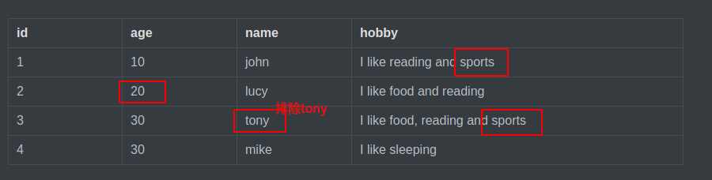
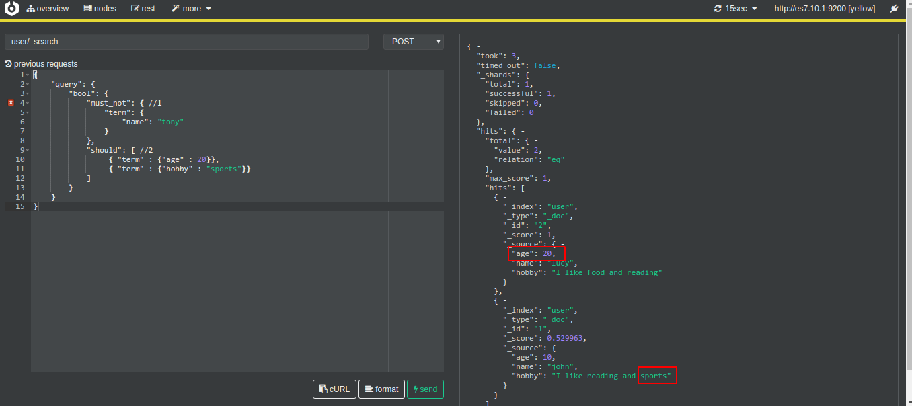
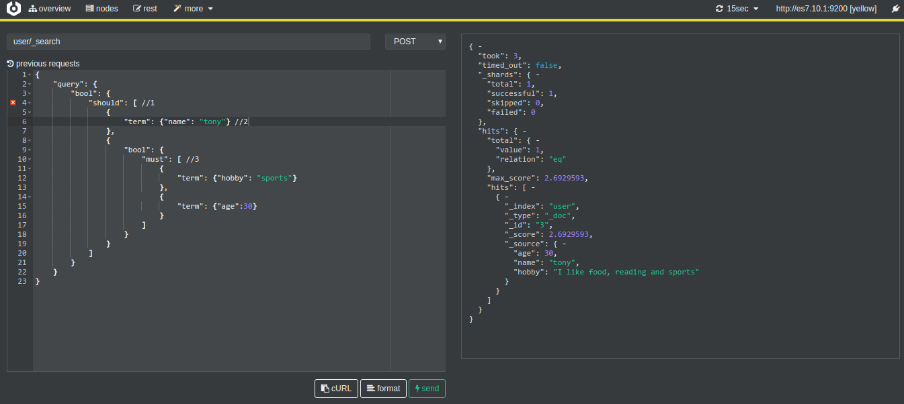
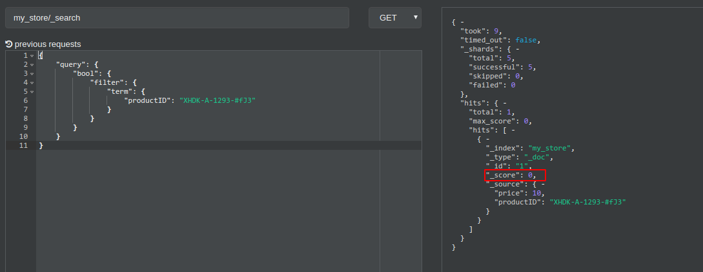
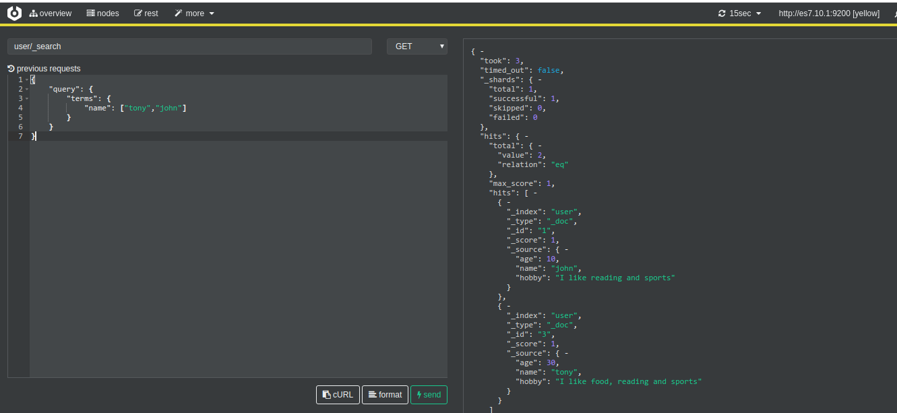

## 目录
本文教程包括如下内容：
- bool查询
	- must，must_not，should，filter查询 
- term查询
https://www.elastic.co/guide/en/elasticsearch/reference/7.x/query-dsl-terms-query.html#query-dsl-terms-lookup-params
	- term精确匹配
	- term查询的注意事项
	- terms匹配一个或多个文档 
	- terms lookup查询 
- exists查询
	- 匹配字段存在的文档
	- 匹配字段不存在的文档
- range查询


## 准备数据
```bash
#创建mapping
curl -H 'Content-type: application/json' -XPUT 'http://127.0.0.1:9200/user' -d '{
 "mappings": {
   "properties": {
    "name": {
     "type": "keyword",
     "ignore_above": 64
    }
   }
 }
}'
#导入数据
curl -H 'Content-type: application/x-ndjson' -XPOST 'http://127.0.0.1:9200/user/_doc/_bulk' -d '{"index":{"_id":1}}
{"age":10,"name":"john","hobby":"I like reading and sports"}
{"index":{"_id":2}}
{"age":20,"name":"lucy","hobby":"I like food and reading"}
{"index":{"_id":3}}
{"age":30,"name":"tony","hobby":"I like food, reading and sports"}
{"index":{"_id":4}}
{"age":30,"name":"mike","hobby":"I like sleeping"}
'

#查看索引分词情况
curl -H 'Content-type: application/json' -XPOST 'http://127.0.0.1:9200/user/_analyze' -d '{
 "field": "name",
 "text": "mike"
}'
```
执行命令后，我们得到下面的数据

| id   | age | name | hobby |
| ---- | ----- | ---------------- | ---------------- |
| 1    | 10    | john | I like reading and sports |
| 2    | 20    | lucy | I like food and reading |
| 3    | 30    | tony | I like food, reading and sports |
| 4    | 30    | mike | I like sleeping |


## bool布尔查询
一个 bool查询由四部分组成：
```bash
{
   "bool" : {
      "must" :     [],
      "should" :   [],
      "must_not" : [],
      "filter":    []
   }
}
```
- must 等价于and,必须匹配。贡献算分
- should 等价于or,选择性匹配，至少满足一条。贡献算分
- must_not 等价于not,过滤子句，必须不能匹配，但不贡献算分
- filter 过滤子句，必须匹配，但不贡献算分

## bool查询
```sql
SELECT *
FROM user
WHERE  (age = 20 OR hobby = "sport") 
AND  (name != "tony")
```
这是一条查询年龄为20或爱好为运动并且不叫tony的用户的sql，我们用`bool`查询实现它
```json
{
    "query": {
        "bool": {
            "must_not": { //1
                "term": {
                    "name": "tony"
                }
            },
            "should": [ //2
                 { "term" : {"age" : 20}}, 
                 { "term" : {"hobby" : "sports"}} 
            ]
        }
    }
}
```
- //1 实现`name != "tony"`条件，先排除名为`tony`的用户数据

- //2 实现`age=20 or hobby="sports"`条件，查询年龄为20或爱好为`sports`的用户
  如上面的bool查询，`must_not`与`should`并排，表示`and`关系，然后`should`里面两个元素表示`or`关系，我们期望的搜索结果如下：

现在我们执行es查询，结果和我期望的结果一致



## 嵌套查询
```sql
SELECT *
FROM   user
WHERE  name = "tony"
OR ( hobby = "sports" AND age = 30 )
```
这次我们换另一个查询方式，查询名字为`tony`或者喜爱`sports`并且30岁的用户数据，用bool查询表示如下：
```json
{
    "query": {
        "bool": {
            "should": [ //1
                {
                	"term": {"name": "tony"} //2
                },
                {
                    "bool": {
                        "must": [ //3
                            {
                                "term": {"hobby": "sports"}
                            },
                        	{
                                "term": {"age":30}
                        	}
                        ]
                    }
                }
            ]
        }
    }
}
```
- //1 实现`or`关系
- //2 实现`productID = "KDKE-B-9947-#kL5"`条件
- //3 实现`productID = "JODL-X-1937-#pV7" AND price = 30`条件
说明：我们的sql语句是`or`关系，可以用`should`来实现，子语句是一个`and`关系，需要用到嵌套一个`bool`查询
说明：首先should里面两个元素表示`or`关系，在`should`里面嵌套两一个`bool`查询，`must`表示`and`关系，我们期望的结果如下：
  执行`bool`查询，得到结果和期望结果一致
  


## filter查询
`filter`查询可以筛选我们想要的数据，它和`match`的不一样的是，`filter`的查询结果不会计算评分，也就是说如果你只是简单想要搜索某些数据并不关心排名，那么可以用`filter`查询，不计算评分意味着查询性能也好。


`filter`搜索结果`_score`分数为0

## term查询
```bash
GET user/_search
{
    "query": {
        "terms": {
            "name": ["tony","john"]
        }
    }
}
```
### terms查询

默认情况下，`Elasticsearch`将terms查询限制为最多65,536个词，您可以使用`index.max_terms_count`设置更改此限制

## exists查询
`exists`用于查询不为null的数据，类似于sql语句的`select * from table where title is not null`
```bash
GET user/_search
{
  "query": {
    "exists": {
     "field":"name"
    }
  }
}
```
查找不存在的field
```bash
GET user/_search
{
  "query": {
    "bool": {
      "must_not": {
        "exists": {
          "field": "name"
        }
      }
    }
  }
}
```

## range查询
```bash
GET user/_search
{
  "query": {
    "range": {
      "age": {
        "gte": 10,
        "lte": 20,
        "boost": 2
      }
    }
  }
}
```


