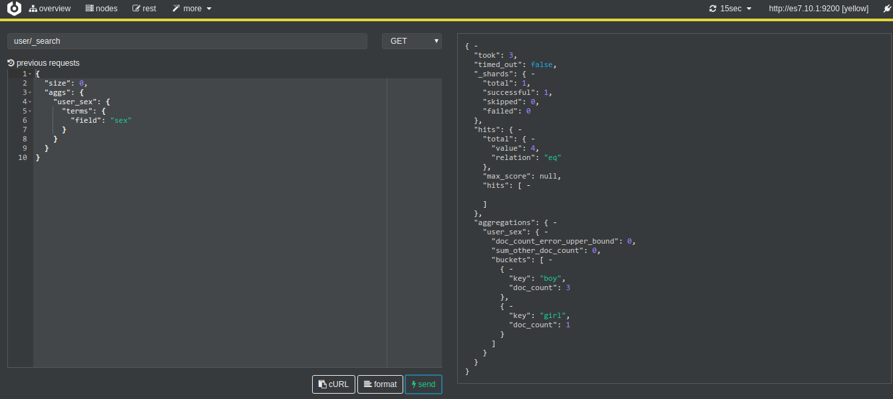
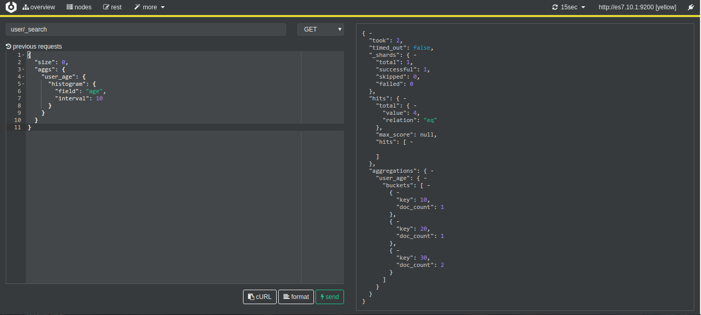
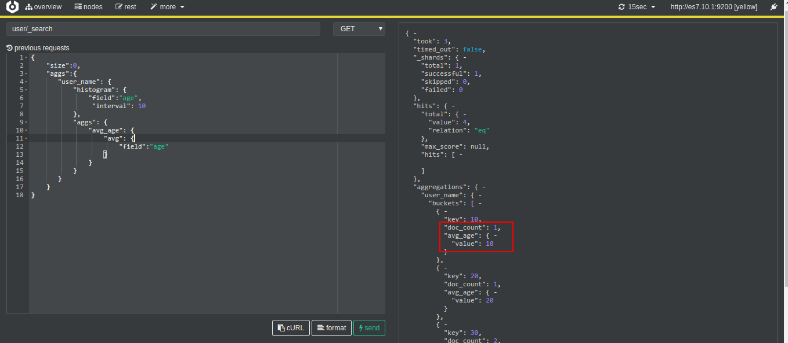
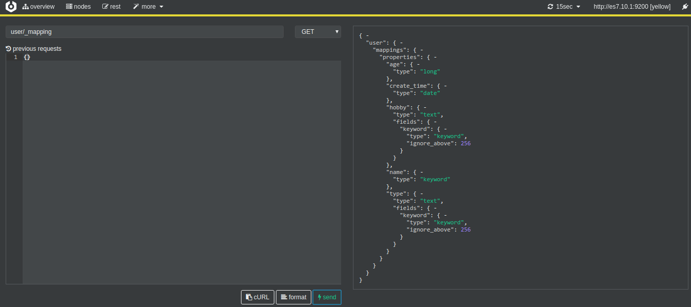
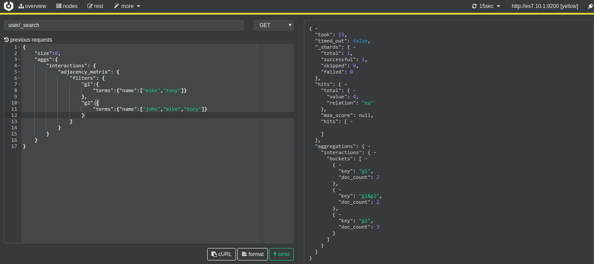

## bucket和metric两大概念
- bucket 一个数据分组
- metric 对一个数据分组执行统计

## 基本结构
```json
"aggregations" : {
    "<aggregation_name>" : {
        "<aggregation_type>" : { # 需要为每个aggs命名
            <aggregation_body>
        }
        [,"meta" : {  [<meta_data_body>] } ]?
        [,"aggregations" : { [<sub_aggregation>]+ } ]?
    }
    [,"<aggregation_name_2>" : { ... } ]*
}
```

## 按term分组

例子：按照用户性别进行分组

```bash
GET user/_search
{
  "size": 0, //1 不返回搜索结果，只返回统计结果
  "aggs": {
    "user_sex": {
      "terms": {
        "field": "sex"
      }
    }
  }
}
```




## histogram区间分组

类型terms,也是进行bucket分组操作，接收一个field，按照这个field的值各个范围区间，进行bucket分组，比如根据年龄区间分组，每个区间为10岁

```bash
GET user/_search
{
  "size": 0,
  "aggs": {
    "user_age": {
      "histogram": {
        "field": "age",
        "interval": 10
      }
    }
  }
}
```

结果如下：



说明：0～10岁有1人，10～20有1人，20～30岁有2人

### histogram 区间内再进一步做统计

完整例子：
```bash
GET user/_search
{
    "size":0,
    "aggs":{
       "user_name": {
           "histogram": {
               "field":"age",
                "interval": 10
           }
       }
    }
}

GET user/_search
{
  "size": 0, //1
  "aggs": {
    "user_name": {
      "histogram": {
        "field": "age",
        "interval": 10
      },
      "aggs": { //2
        "avg_age": {
          "avg": {
            "field": "age"
          }
        }
      }
    }
  }
}
```

- //1 size为0表示不要返回搜索结果

- //2 `aggs`和`histogram`同一级，`histogram`得到结果放在新字段`doc_count`，而`aggs`是在各个区间内再进行分组聚合求平均值，然后放在`avg_age`字段，结果如下：

  


## histogram 月统计

- size:0 表示不返回搜索的结果
- date_histogram下的field必须是一个date类型
- min_doc_count 表示为0时，也要包括
- extended_bounds 指定范围，否则开始时间是从有数据开始

修改mapping，设置`create_time`为`date`类型
```bash
PUT user/_mapping
{
    "properties": {
        "create_time": {
            "type" : "date"
        }
    }
}
```


增加`create_time`字段后，开始查询

统计：

```bash
GET user/_search
{
  "size": 0,
  "aggs": {
    "type_group": { //1
      "date_histogram": {
        "field": "create_time", //2
        "interval": "day", //3
        "format": "yyyy-MM-dd", 
        "min_doc_count": 0, //4
        "extended_bounds": { //5
          "min": "2020-12-12",
          "max": "2020-12-13"
        }
      },
      "aggs": {
        "age_num": {
          "sum": {
            "field": "age"
          }
        }
      }
    }
  }
}
```

- //1 `type_group`是我们自定义的分组名称，每个分组结果都会放在`type_group`之下
- //2 `field` 指定以哪个字段来进行分组，类型必须为`date`类型
- //3 `interval` 分组区间单位为天
- //4 `min_doc_count` 表示最少有多少个文档才会返回，例如`2020-12-12`只找到1条记录，而`min_doc_count`设置为2，则返回的结果中不会包含`2020-12-12`这天的数据
- //5 `extended_bounds` 可以指定开始时间或结束时间，如果没有指定，则开始时间是从有数据开始

## 单个商品和总商品的比较 global bucket

```bash
curl -XGET "http://elasticsearch:9200/my_index/weike/_search" -H 'Content-Type: application/json' -d'
{
  "size": 0, 
  "query": {
    "term": {
      "type": {
        "value": "course" # 匹配course类型
      }
  }
  },
  "aggs": {
    "sigal_avg_play_num": {
      "avg": {
        "field": "playnum" # 求course类型平均播放量
      }
    },
    "all":{
      "global": {},
      "aggs": {
        "total_avg_play_num": {
          "avg": {
            "field": "playnum" @ 所有类型播放量
          }
        }
      }
    }
  }
}'
```

## 过滤加聚合
```bash
curl -XGET "http://elasticsearch:9200/my_index/weike/_search" -H 'Content-Type: application/json' -d'
{
  "size": 0, 
  "query": {
    "constant_score": {
      "filter": {
        "match": {
          "title": {
            "query":"world"
          }
        }
      }
    }
  },
  "aggs": {
    "group_by_type": {
      "sum": {
        "field": "playnum"
      }
    }
  }
}'
```

## 聚合排序
- 默认排序是根据`doc_count`倒序排序
- 主要是使用`order`字段，order需要用自定义的aggs字段名，例如avg_playnum
```bash
curl -XGET "http://elasticsearch:9200/my_index/weike/_search" -H 'Content-Type: application/json' -d'
{
  "size": 0,
  "query": {
    "constant_score": {
      "filter": {
        "match": {
          "title": {
            "query": "hello"
          }
        }
      }
    }
  },
  "aggs": {
    "group_by_type": {
      "terms": {
        "field": "type.keyword",
        "order": {
          "avg_playnum": "asc" # 对每个类型下播放数平均值进行排序
        }
      },
      "aggs": {
        "avg_playnum": {
          "avg": {
            "field": "playnum"
          }
        }
      }
    }
  }
}'
```

## 易并行算法，进似聚合
数据统计有两种方式
- 大数据+实时 用es，会有错误率
- 大数据+精准 hadoop，非实时，可能会跑几个小时


## cartinality metric 去重统计
对每个bucket指定的field进行去重，取去重后的count，类似于count(distcint)，不是完全准确的，会有错误率
```bash
curl -XGET "http://elasticsearch:9200/my_index/weike/_search" -H 'Content-Type: application/json' -d'
{
  "size": 0,
  "aggs": {
    "months": {
      "date_histogram": {
        "field": "create_date_2",
        "interval": "day",
        "format": "yyyy-MM-dd"
      },
      "aggs": {
        "distinct_type": {
          "cardinality": {
            "field": "type.keyword" # 统计每一天下，每个类型的个数
          }
        }
      }
    }
  }
}'
```

## cardinality算法优化内存开销
- cardinality结果并不精确，如果要精确会占用大量的内存，可以用过`precision_threshold`来控制，占用内存等于`precision_threshold × 8`字节，在`precision_threshold`内，结果都是几乎准确的
```bash
curl -XGET "http://elasticsearch:9200/my_index/weike/_search" -H 'Content-Type: application/json' -d'
{
  "size": 0,
  "aggs": {
    "months": {
      "date_histogram": {
        "field": "create_date_2",
        "interval": "day",
        "format": "yyyy-MM-dd"
      },
      "aggs": {
        "distinct_type": {
          "cardinality": {
            "field": "type.keyword",
            "precision_threshold": 100
          }
        }
      }
    }
  }
}'
```

## 各个百分比统计
- 如同压测一样，50%请求在多少秒内，80%请求在多少秒内，所有请求在多少秒内
- 主要用到了`percentiles`，如果想自己指定值，可以用`percentile_ranks`
```bash
curl -XGET "http://elasticsearch:9200/my_index/weike/_search" -H 'Content-Type: application/json' -d'
{
  "size": 0,
  "aggs": {
    "group_by_type": {
      "terms": {
        "field": "type.keyword"
      },
      "aggs": {
        "play_time": {
          "percentiles": {
            "field": "playnum",
            "percents": [ # 百分比
              1,
              5,
              25,
              50,
              75,
              95,
              99
            ]
          }
        },
        "play_time_avg": {
          "avg":{
              "field": "playnum" # 所有播放平均数
            }
          }
      }
    }
  }
  
}'
```
优化


## 广度优先搜索
主要设置`terms.collect_mode = breadth_first`，目的是为了减少搜索量？？？如果不排序确实可以减少，要排序还是的查找所有然后再下一步
```bash
curl -XGET "http://elasticsearch:9200/my_index/weike/_search" -H 'Content-Type: application/json' -d'
{
  "size": 0,
  "aggs": {
    "group_by_type": {
      "terms": {
        "field": "type.keyword",
        "size": 2,
        "collect_mode": "breadth_first",
        "order": {
          "play_num_sum": "asc"
        }
      },
      "aggs": {
        "play_num_sum": {
          "sum": {
            "field": "playnum"
          }
        }
      }
    }
  }
}'
```

## 统计最近7天，30天，3个月的数据
```bash
curl -XGET "http://elasticsearch:9200/kt_content/_search" -H 'Content-Type: application/json' -d'
{
  "size": 0,
  "query": {
    "constant_score": {
      "filter": {
        "bool": {
          "must": [
            {
              "term": {
                "fdDisabled": {
                  "value": 0
                }
              }
            },
            {
              "term": {
                "fdUserID": {
                  "value": 9131
                }
              }
            }
          ]
        }
      }
    }
  },
  "aggs": {
    "recent_90d": {
      "filter": {
        "range": {
          "fdCreate": {
            "gte": "now-90d"
          }
        }
      }
    },
    "recent_30d": {
      "filter": {
        "range": {
          "fdCreate": {
            "gte": "now-30d"
          }
        }
      }
    },
    "recent_7d": {
      "filter": {
        "range": {
          "fdCreate": {
            "gte": "now-7d"
          }
        }
      }
    }
  }
}'
```


## Adjacency matrix aggregation 邻近矩阵聚合
https://blog.csdn.net/wjzt7322/article/details/103579938
```bash
GET user/_search
{
    "size":0,
    "aggs":{
        "interactions": {
            "adjacency_matrix": {
                "filters": {
                    "g1":{
                        "terms":{"name":["mike","tony"]}
                    },
                    "g2":{
                        "terms":{"name":["john","mike","tony"]}
                    }
                }
            }
        }
    }
}
```
- g1 匹配`mike`和`tony`共计两个doc
- g2 匹配`john`,`mike`,`tony`共计三个doc
- g1&g2 取交集，匹配`mike`和`tony`两个doc




