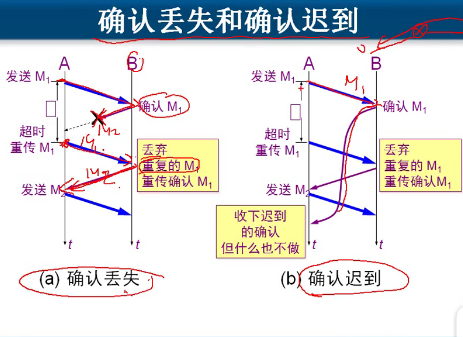

根据目标IP和端口就能找到是哪个应用程序
端口扫描,知道你有什么服务,看看有什么漏洞

- 传输层(tcp,udp协议)为应用程序提供了逻辑通信
- 网络层(IP协议)为主机之间的逻辑通信
- 传输层需要对收到的报文进行差错检测

## 协议号
协议号就是用来区分不用的协议的
- tcp 6
- udp 17
- igmp 1

## udp 
,传输的是字节流,建立连接需要3次握手

- 超时重传
- 确认丢失
- 确认失败