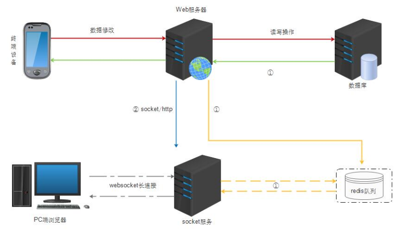

订阅发布主要用于广播系统,例如聊天系统中的群聊,消息推送,同步操作等等;这里以同步操作为例子作为讲解
  
图片来源于https://www.cnblogs.com/JasonLeemz/p/5116814.html  
##### 大概流程如下:
- pc端游览器与websocket建立长连接
- websocket订阅redis (subscribe channel),一旦channel有数据,websocket主动推送数据给pc端游览器
- 手机设备修改数据,并执行发布 (publish channel message)
- websocket获取到channel的message,主动推送给pc游览器
##### 注意点:
- redis的订阅发布使用php内置的socket,默认超时时间为60秒,需要设置ini_set('default_socket_timeout', -1);
- php的redis扩展为阻塞IO,当websocket订阅redis,整个进程会阻塞,导致服务端的websocket不能处理其他事件,从而无法记录长连接fd,解决方法用异步redis
##### 下面是一个简单的基于swoole异步redis实现的websocket服务端
```php
class WebsocketServer
{
    public $fdMaps = [];

    /** @var \Swoole\WebSocket\Server */
    public $ws;

    public function __construct()
    {
        $this->ws = new Swoole\WebSocket\Server('0.0.0.0', 9503);
        $this->ws->on('open', [$this, 'open']);
        $this->ws->on('close', [$this, 'close']);
        $this->ws->on('workerStart', [$this, 'workerStart']);
        $this->ws->on('message', [$this, 'message']);
        $this->ws->set([
            'worker_num' => 1,
            'daemonize'  => 0,
        ]);
        $this->ws->start();
    }

    public function message($server, $frame)
    {
        $server->push($frame->fd, "hello");
    }

    public function workerStart(\Swoole\WebSocket\Server $server, $workerID)
    {
        $client = new \Swoole\Redis();
        $client->on('message', function ($client, $result) use ($server) {
            if ($result[0] == 'message') {
                foreach ($server->connections as $fd) {
                    $server->push($fd, $result[2]);
                }
            }
        });
        $client->connect('127.0.0.1', 6379, function ($client, $result) {
            $client->subscribe('channel');
        });
    }

    public function open($server, $request)
    {
        echo "fd $request->fd connect \n";
        $this->fdMaps[$request->fd] = $request->fd;
    }

    public function close($server, $fd)
    {
        if (isset($this->fdMaps[$fd])) {
            unset($this->fdMaps[$fd]);
            echo "fd $fd close \n";
        } else {
            echo "error\n";
        }
    }
}

new WebsocketServer();
```
html代码:
```html
<html>
<body>
<h1>Redis publish/subscribe</h1>
<div id="show-list"></div>
</body>
</html>
<script type="text/javascript" src="/chat/js/jquery.min.js"></script>
<script>
    $(function () {
        var ws = new WebSocket('ws://127.0.0.1:9503');
        ws.onopen = function () {
            console.log('connect success');
        };

        // 接受消息
        ws.onmessage = function (evt) {
            console.log(evt.data);
            var html = '<h3>' + evt.data + '</h3>';
            $('#show-list').append(html);
        };

        ws.onclose = function () {
            console.log('connect close');
        };
    });
</script>
```
调试:  
```bash
127.0.0.1:6379> publish channel hello
(integer) 1
# 响应的pc游览器会显示hello
```