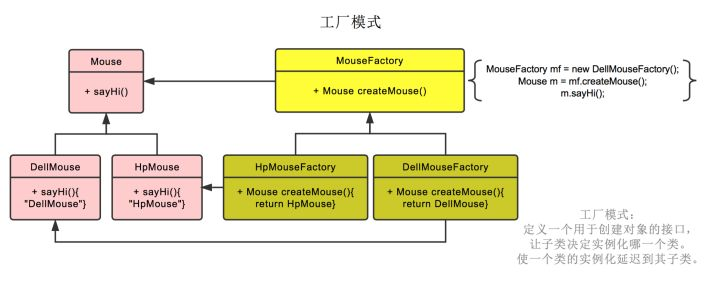

## 简单工厂模式

## 工厂模式

工厂方法模式：一个抽象产品类，可以派生出多个具体产品类。 一个抽象工厂类，可以派生出多个具体工厂类。 每个具体工厂类只能创建一个具体产品类的实例。 

例如Mouse是抽象产品类，它可以派生出DellMouse和HpMouse两个具体的产品类，MouseFactory是抽象工厂类，派生出HpMouseFactory和DellMouseFactory两个具体工厂类。每个具体工厂类只能创建一个具体产品类实例，如HpMouseFactory只能创建HpMouse具体产品类。

## 抽象工厂模式

抽象工厂模式： 多个抽象产品类，每个抽象产品类可以派生出多个具体产品类。 一个抽象工厂类，可以派生出多个具体工厂类，每个具体工厂类可以创建多个具体产品类的实例。

  

 

## 工厂模式和抽象工厂模式区别

区别： 工厂方法模式只有一个抽象产品类，而抽象工厂模式有多个。 工厂方法模式的具体工厂类只能创建一个具体产品类的实例，而抽象工厂模式可以创建多类具体产品。

## 参考

<https://www.zhihu.com/question/20367734>