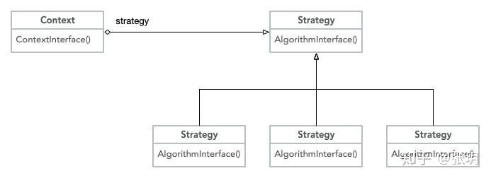

## 简介

策略模式属于**行为型模式**，它封装了一系列的算法，客户端在不同场景下可以通过上下文来调用不同的算法。


## 应用场景

- 需要在不同情况下使用不同的策略(算法)，或者策略还可能在未来用其它方式来实现。
- 对客户隐藏具体策略(算法)的实现细节，彼此完全独立。
- 客户端必须知道所有的策略类，并自行决定使用哪一个策略类，策略模式只适用于客户端知道所有的算法或行为的情况。
- 策略模式造成很多的策略类，每个具体策略类都会产生一个新类。


## php代码实现

需要关注的几个对象

- 策略上下文环境 `Context`
- 策略接口类`Strategy`，定义具体策略类需要实现的方法`AlgorithnInteraface()`
- 具体策略实现类`ConcreteStrategyA`



```php
interface Strategy{
    function AlgorithmInterface();
}

class ConcreteStrategyA implements Strategy{
    function AlgorithmInterface(){
        echo "算法A";
    }
}

class ConcreteStrategyB implements Strategy{
    function AlgorithmInterface(){
        echo "算法B";
    }
}

class ConcreteStrategyC implements Strategy{
    function AlgorithmInterface(){
        echo "算法C";
    }
}
```

### 定义算法抽象及实现

```php
class Context{
    private $strategy;
    function __construct(Strategy $s){
        $this->strategy = $s;
    }
    function ContextInterface(){
        
        $this->strategy->AlgorithmInterface();
    }
}

```

### 定义执行环境上下文

```php
$strategyA = new ConcreteStrategyA();
$context = new Context($strategyA);
$context->ContextInterface();

$strategyB = new ConcreteStrategyB();
$context = new Context($strategyB);
$context->ContextInterface();

$strategyC = new ConcreteStrategyC();
$context = new Context($strategyC);
$context->ContextInterface();
```


## 策略模式和简单工厂模式的区别？

- 工厂相关的模式属于创建型模式，顾名思义，这种模式是用来创建对象的，返回的是new出来的对象。要调用对象的什么方法是由客户端来决定的
- 而策略模式属性行为型模式，通过执行上下文，将要调用的函数方法封装了起来，客户端只需要调用执行上下文的方法就可以了
- 简而言之，工厂模式着眼于得到对象,并操作对象，策略模式,着重得到对象某方法的运行结果


## 参考

- <https://zhuanlan.zhihu.com/p/105954533>