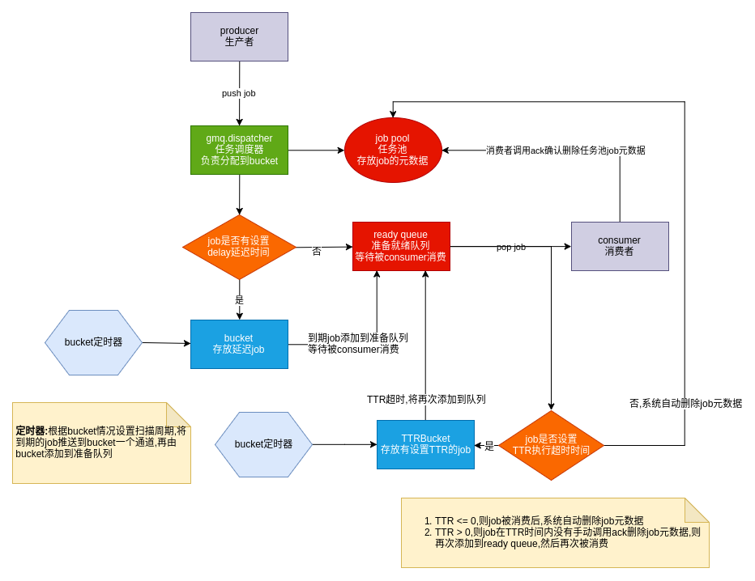
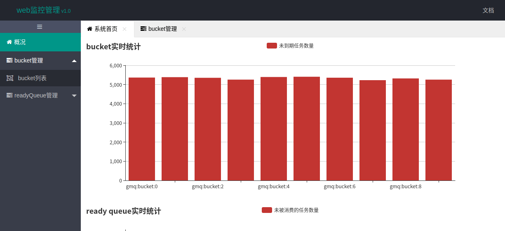
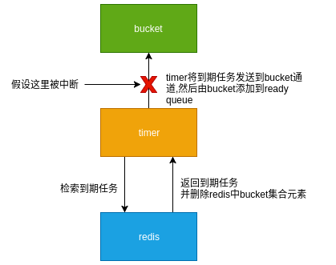
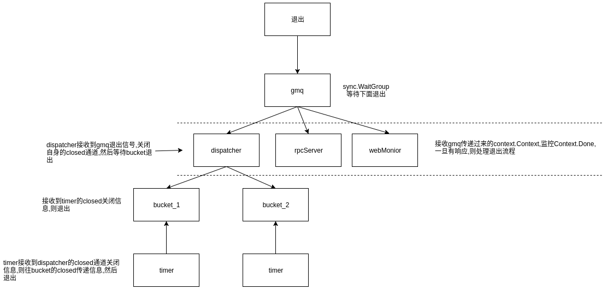

## 概述
`gmq`是基于`redis`提供的特性,使用`go`语言开发的一个简单易用的队列;关于redis使用特性可以参考之前本人写过一篇很简陋的文章[Redis 实现队列](https://segmentfault.com/a/1190000011084493);
`gmq`的灵感和设计是基于[有赞延迟队列设计](https://tech.youzan.com/queuing_delay/),文章内容清晰而且很好理解,但是没有提供源码链接,在文章的最后也提到了一些未来架构方向,于是也就有了`gmq`
> `gmq`不是简单按照有赞延迟队列设计来实现功能,而是经过自己的思考,在原有的设计的基础上,做了一些修改,文章的最后会有一个和原设计的对比

## gmq流程如下:


## web监控
`gmq`提供了一个简单web监控平台,方便查看当前堆积任务数以及运行情况,默认监听端口为`9503`,界面如下:


## 应用场景
- 延迟任务
    - 延迟任务,例如用户下订单一直处于未支付状态，半个小时候自动关闭订单
- 异步任务
    - 异步任务,一般用于耗时操作,例如群发邮件等批量操作
- 超时任务
    - 规定时间内`(TTR)`没有执行完毕或程序被意外中断,以致于没有反馈ack给gmq,则gmq会在TTR之后将job重新加到队列然后再次被消费,一般用于数据比较敏感,不容丢失的
- 优先级任务
    - 当多个任务同时产生时,按照任务设定等级优先被消费,例如a,b两种类型的job,当有a类型job时优先消费,没有了再消费b类型job
    
## 安装
### 源码运行
配置文件位于`gmq/conf.ini`,可以根据自己项目需求修改配置
```bash
git clone https://github.com/wuzhc/gmq.git
cd gmq
go get -u -v github.com/kardianos/govendor # 如果有就不需要安装了
govendor sync
go run main.go
# go build # 可编译成可执行文件
```
### 执行文件运行
```bash
./gmq &
```

## 使用
目前只实现python,go,php语言的客户端的demo
### php
```php
// consumer.php 消费者
$client = new JsonRPC("127.0.0.1", 9503);
while (true) {
    $r = $client->Call("Service.Pop", array_slice($topic,rand(0,7)));
    if (!$r) {
        // 是否断开连接了
        print_r($client->getErrors());exit;
    }
    print_r($r);
    // sleep(2);
    // print_r($r);
    echo 'POP ' . $r['result']['id'] . PHP_EOL;
    if (!empty($r['error'])) {
        if ($r['error'] == 'empty') {
            echo '[' . date('Y-m-d H:i:s') . '] no jobs and will sleep 3 seconds' . PHP_EOL;
            echo '已处理' . $n . PHP_EOL;
            // $client->close();
            sleep(3);
            continue;
        }
    }
    $result = $r['result'];
    if ($result['TTR'] > 0) {
        echo 'ACK' . $result['id'] . PHP_EOL;
        $r = $client->Call('Service.Ack', $result['id']);
        // print_r($r);
    }
    $n++;
    echo '已处理' . $n . PHP_EOL;
}
$client->close();
```

```php
// consumer.php 生产者
$client = new JsonRPC("127.0.0.1", 9503);
for ($i = 0; $i < 100000; $i++) {
    $data = [
        'id'    => 'xxxx_id' . microtime(true) . rand(1,999999999),
        'topic' => $topic[rand(0, 7)],
        'body'  => 'this is a rpc test',
        'delay' => (string)rand(0, 1000),
        'TTR'   => '3'
    ];
    $r = $client->Call("Service.Push", $data);
    if ($client->getErrors()) {
        echo $client->getErrors() . PHP_EOL;
        sleep(3);
    } else {
        print_r($r);
        echo $i . ' ' . $r['result'] . '---' . PHP_EOL;
    }
}
$client->close();
```

## 遇到问题
以下是开发遇到的问题,以及一些粗糙的解决方案

### 安全退出
如果强行中止`gmq`的运行,可能会导致一些数据丢失,例如下面一个例子:  
  
如果发生上面的情况,就会出现job不在`bucket`中,也不在`ready queue`,这就出现了job丢失的情况,而且将没有任何机会去删除`job pool`中已丢失的job,长久之后`job pool`可能会堆积很多的已丢失job的元数据;所以安全退出需要在接收到退出信号时,应该等待所有`goroutine`处理完手中的事情,然后再退出

####  `gmq`退出方案
  
首先`gmq`通过context传递关闭信号给`dispatcher`,`dispatcher`接收到信号会关闭`dispatcher.closed`,每个`bucket`会收到`close`信号,然后先退出`timer`检索,再退出`bucket`,`dispatcher`等待所有bucket退出后,然后退出

`dispatcher`退出顺序流程: `timer` -> `bucket` -> `dispatcher`

#### 注意
不要使用`kill -9 pid`来强制杀死进程,因为系统无法捕获SIGKILL信号,导致gmq可能执行到一半就被强制中止,应该使用`kill -15 pid`,`kill -1 pid`或`kill -2 pid`,各个数字对应信号如下:
- 9 对应SIGKILL
- 15 对应SIGTERM
- 1 对应SIGHUP
- 2 对应SIGINT
- [https://www.jianshu.com/p/5729fc095b2a](https://www.jianshu.com/p/5729fc095b2a)  


### 热更新
程序需要升级,但是又不能直接关闭服务,需要接收客户端的请求;而go不像php一样动态解析代码,go是编译成一个可执行文件,如果需要升级服务需要替换整个执行文件,一般操作如下:
- 多部署几个服务,当服务需要升级时,一个个替换,把替换的服务请求打到其他服务,替换后在接收请求,类似的方式替换掉所有的服务
- fork子进程,当子进程重启服务,父进程退出,子进程缺少父进程会成为孤儿进程,托管到init进程

### 确认机制
任务被消费者获取之后,只是删除了队列job信息,`job pool`不会去删除job元数据,只有当消费者手动发起`ack`确认删除;另外,如果当`TTR=0`时,即job不会有超时时间,可以无限的执行,此时`gmq`会在消费获取job之后就直接删掉`job pool`任务

### 智能定时器
每一个`bucket`会维护一个定时器,定时器并非周期性的时钟,通俗来讲,即不是每隔多久执行一次;首先先获取`bucket`下一个要执行`job`的时间,然后用这个时间作为定时器的周期,这样当没有job时不会有其他开销;当然,事物都有两面性,这样的设计带来的弊端就是当生成者产生一个新数据时会可能需要重置定时器的时间,频繁产生意味着频繁重置定时器

### 原子性问题
成功添加到bucket时,会去设置job.status,但是,因为添加bucket和设置job.status是两个方法,两个方法分别去获取redis连接池句柄,此时会出现添加bucket成功后,但是设置job.status获取连接句柄失败(因为访问量大,连接池耗尽了),设置job.status就会阻塞在那里;如果这个时候定时器扫描到bucket,就会得到status是错误的
redis对请求是排队处理,假设我们添加一个job到bucket,经历的过程大概是add bucket -> set job status; 此时如果在`add bucket`和`set job status`两个命令之间插入其他命令,就会使得这个事物原子性问题
gmq会很多这样的场景,为此我用redis的`lua脚本`替换了所有涉及事务的代码,考虑到用`lua脚本`而不是`MULTI/EXEC`是为了减少gmq和`redis server`通信次数,并且`lua脚本`有利于之后的redis分片

#### `timer`扫描job的过程由`lua`脚本实现如下:
```lua
-- 获取到期的50个job
local jobIds = redis.call('zrangebyscore',KEYS[1], 0, ARGV[4], 'withscores', 'limit', 0, 50)
local res = {}
for k,jobId in ipairs(jobIds) do 
	if k%2~=0 then
		local jobKey = string.format('%s:%s', ARGV[3], jobId)
		local status = redis.call('hget', jobKey, 'status')
		-- 检验job状态
		if tonumber(status) == tonumber(ARGV[1]) or tonumber(status) == tonumber(ARGV[2]) then
			-- 先移除集合中到期的job,然后到期的job返回给timer
			local isDel = redis.call('zrem', KEYS[1], jobId)
			if isDel == 1 then
				table.insert(res, jobId)
			end
		end
	end
end

local nextTime
-- 计算下一个job执行时间,用于设置timer下一个时钟周期
local nextJob = redis.call('zrange', KEYS[1], 0, 0, 'withscores')
if next(nextJob) == nil then
	nextTime = -1
else
	nextTime = tonumber(nextJob[2]) - tonumber(ARGV[4])
	if nextTime < 0 then
		nextTime = 1
	end
end

table.insert(res,1,nextTime)
return res
```

### redis连接池
刚好第三方库`redis`自带了连接池,我也可以不需要自行实现连接池,连接池是很有必要的,它带来的好处是限制redis连接数,通过复用redis连接来减少开销,另外可以防止tcp被消耗完,这在生产者大量生成数据时会很有用

### 设置job执行超时时间TTR(TIME TO RUN)
当job被消费者读取后,如果`job.TTR>0`,即job设置了执行超时时间,那么job会在读取后添加到bucket,并且设置`job.delay = job.TTR`,在TTR时间内没有得到消费者ack确认删除job,job将在TTR时间之后添加到`ready queue`,然后再次被消费(如果消费者在TTR时间之后才请求ack,会得到失败的响应)

## 使用中可能出现的问题
### 客户端出现大量的TIME_WAIT状态,并且新的连接被拒绝
```bash
netstat -anp | grep 9503 | wc -l
tcp        0      0 10.8.8.188:41482        10.8.8.185:9503         TIME_WAIT   -                   
```
这个在大并发的场景下是正常现象,socket连接为了保证每个连接正常关闭,会处于`TIME_WAIT`状态,并且等待2ML时间后消失; 如果要避免大量`TIME_WAIT`的连接导致tcp被耗尽;一般方法如下:
- 使用长连接,而不是每个请求一个连接
- 配置文件,网上很多教程,就是让系统尽快的回收`TIME_WAIT`状态的连接
- 使用连接池,当连接池耗尽时,阻塞等待,直到连接回收


- bucket有job,但是pool没有job
- bucket.JobNum计数有问题
- bucket存在status=ready的job (原本是在bucket中,job.status=delay,强制重启后job.status=ready,但未被加入到readQueue
- jobPool出现只有{status:1}的job (10万个快速请求造成的) 可能的原因: addBucket -> 被中断执行了 delete job -> bucket又设置了状态
- [E][default] [2019-06-23 22:38:24] strconv.Atoi: parsing "": invalid syntax (可能和上一个bug有关)

## 和有赞设计对比
- 支持普通消息,在有赞的文章中是延迟队列;事实上,如果延迟时间为0时,就可以当普通队列处理,这个时候不在添加到bucket,而是直接添加到准备就绪队列

- 不用一个timer调度,而是每个bucket维护一个timer;在有赞设计,所有的调度都由timer处理,这个我的设计是一个bucket维护一个timer
- timer不在定时轮询,也是根据bucket情况设计定时周期

- 区分bucket和TTRBucket,在有赞设计的文章中是把设置了TTR的job再次添加到bucket,个人觉的这会混淆,区分开,便于我们监控消息的实际情况

- job结构添加consume_num消费次数,这个应该是很多人都希望知道的,例如某个程序在消费任务时,总是执行到一般就挂掉了,那么job将无限次的被消费,形成了一个死循环,如果有消费次数,客户端获得任务可以先检测consume_sum的次数是否过多,如果是,则做错误log,并调用`ack`确认删除job

- 批量获取bucket到期任务,而不是一次一个,在有赞文章提到`多个bucket是为了提高扫描速度，降低消息延迟`,本人的理解是降低消息延迟其实就是让bucket中到期的job尽可能快的添加到`ready queue`,bucket本身就是一个有序集合,里面的job其实已经是排好队,一直轮询一个bucket,用`zrangebyscore key offset limt`命令一次性取出多几条有序集合中已经到期的job,而且即时并行扫到很多job的,也不能并行写到redis,因为redis的命令是排队执行; 所以,个人对于多个bucket是否能降低消息延迟是有怀疑态度的;而在`gmq`设计中,还是保留多个bucket,毕竟单个bucket堆积太多的job也不是什么好事,而且,bucket除了定时扫描,还可以做一些耗时操作

- 提供TCP长连的API

## 相关链接
- [有赞延迟队列设计](https://tech.youzan.com/queuing_delay/)
- [Redis 实现队列](https://segmentfault.com/a/1190000011084493)
